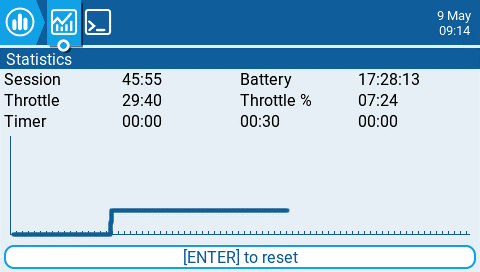
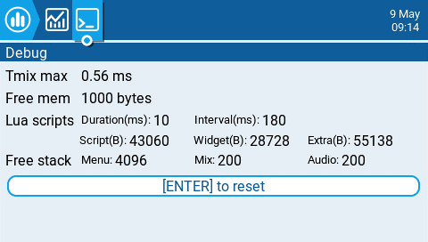

Екран **Statistics** відображає статистику використання пульта. За винятком Battery, усі дані скидаються після вимкнення пульта. Надається наступна інформація:

* **Session** - Час, протягом якого пульт був увімкнений.
* **Battery** - Час, протягом якого пульт був увімкнений з моменту останнього скидання.
* **Throttle** - Час, протягом якого стік газу (throttle) знаходився вище позиції 0%.
* **Throttle %** - Час, протягом якого стік газу знаходився вище позиції 50%.
* **Timer** - Поточні значення Timer 1, Timer 2, Timer 3.

Екран налагодження (debug) надає дані, які розробники використовують під час пошуку та усунення помилок у програмному забезпеченні. Для більшості користувачів інформація на цьому екрані не буде корисною, хіба що під час спільного з розробниками налагодження проблем. Надається наступна інформація для налагодження:

* **TMix max** - Максимальна тривалість задачі мікшера.
* **Free mem** - Поточний обсяг вільної пам'яті пульта в байтах.
* **Lua scripts**
  * **Duration(ms) -** Максимальна тривалість виконання Lua у мілісекундах.
  * **Interval(ms)** - Максимальний інтервал Lua у мілісекундах.
  * **Script(B)** - Пам'ять, що використовується скриптами LUA.
  * **Widget(B)** - Пам'ять, що використовується віджетами LUA.
  * **Extra(B)** - Пам'ять, що використовується функціями растрових зображень (bitmap) LUA.
* **Free stack**
  * **\[Menu]** - Мінімальний обсяг вільної пам'яті стека для задач меню.
  * **\[Mix]** - Мінімальний обсяг вільної пам'яті стека для задач мікшера.
  * **\[Audio]** - Мінімальний обсяг вільної пам'яті стека для аудіозадач.

---

Джерело: [EdgeTX User Manual 2.11](https://github.com/EdgeTX/edgetx-user-manual/blob/2.11/color-radios/statistics.md), ліцензія [CC BY-SA 4.0](https://creativecommons.org/licenses/by-sa/4.0/). Український переклад підготовлений для dead.md.
