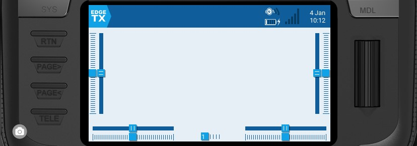
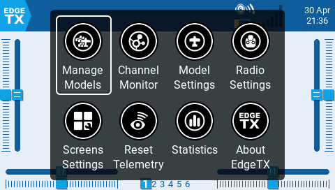

Навігація інтерфейсом користувача EdgeTX може здійснюватися за допомогою фізичних кнопок, сенсорного інтерфейсу або їх комбінації.

### **Кнопки**

*   **\[SYS]** - Системна кнопка\
    \- Коротке натискання кнопки **\[SYS]** відкриває сторінку [Radio Settings](/docs/rc/edgetx-tx16s/radio-settings/).

    \- Довге натискання кнопки **\[SYS]** відкриває сторінку [Radio Setup](/docs/rc/edgetx-tx16s/radio-settings/radio-setup/).
* **\[MDL]** - Кнопка моделі\
  \- Коротке натискання кнопки **\[MDL]** відкриває сторінку [Model Settings](/docs/rc/edgetx-tx16s/model-settings/)\
  \- Довге натискання кнопки **\[MDL]** відкриває сторінку [Select Model](../select-model.md)
* **\[RTN] -** Повернення / Назад \
  \- Коротке натискання кнопки **\[RTN]** повертає до попередньої сторінки, попереднього меню або скасовує дію
* **\[PAGE>] / \[PAGE&lt;]** - Наступна та попередня сторінка\
  \- Використовується для навігації між різними екранами, вкладками або налаштуваннями опцій, залежно від екрана.
*   **\[TELE] -** Телеметрія \
    \- Коротке натискання кнопки **\[TELE]** відкриває сторінку [Screen Settings](/docs/rc/edgetx-tx16s/screen-settings/)

     -Довге натискання кнопки **\[TELE]** відкриває сторінку [Channel Monitor](../channel-monitor.md)
* **\[Roller]** або **\[Dial]** - Наступне та попереднє значення\
  Ролик використовується для навігації по опціях меню.
* **\[Enter]** - Підтвердження \
  \- Використовується для вибору опції, функції або підтвердження значення\
  \- Натисніть на **\[Roller]** або **\[Dial]**, щоб вибрати або підтвердити.

### Додаткові функції кнопок System та Model

Кнопки системи та моделі мають різні функції залежно від того, на якому екрані інтерфейсу користувача ви перебуваєте:

**На екрані Radio Setup:**

* Коротке натискання **\[MDL]** перемикає на екран Model Setup
* Довге натискання **\[MDL]** перемикає на екран Manage Models

**На екрані Model Setup:**

* Коротке натискання **\[SYS]** перемикає на екран Radio Setup (TOOLS)
* Довге натискання **\[SYS]** перемикає на екран Radio Setup (SETUP)
* Коротке натискання **\[MDL]** перемикає на Channel Monitor (існуюча функція)
* Довге натискання **\[MDL]** перемикає на екран Manage Models

**На екрані Channels Monitor:**

* Коротке натискання **\[MDL]** перемикає на екран Model Setup
* Довге натискання **\[MDL]** перемикає на екран Manage Models
* Коротке натискання **\[SYS]** перемикає на екран Radio Setup (TOOLS)
* Довге натискання **\[SYS]** перемикає на екран Radio Setup (SETUP)

**На екрані Manage Model:**

* Коротке натискання **\[MDL]** перемикає на екран Model Setup
* Коротке натискання **\[SYS]** перемикає на екран Radio Setup (TOOLS)
* Довге натискання **\[SYS]** перемикає на екран Radio Setup (SETUP)

### **Сенсорний інтерфейс**

Деякі пульти оснащені сенсорним екраном. На таких пультах ви можете взаємодіяти з опціями меню як за допомогою дотиків, так і за допомогою фізичних кнопок.

:::info
Сенсорний інтерфейс можна вимкнути, налаштувавши спеціальну функцію. Дивіться [special-functions.md](../model-settings/special-functions.md) для отримання додаткової інформації.
:::

Торкніться іконки EdgeTX у верхньому лівому куті екрана, щоб відкрити головне навігаційне меню. Торкніться потрібної опції меню, щоб вибрати її.

:::info
Для моделей, які мають дійсний файл контрольного списку моделі в папці **Models**, після іконки **Manage Models** додається іконка **Model Notes**. Дізнайтеся більше про нотатки до моделі [тут](https://github.com/EdgeTX/edgetx-user-manual/blob/2.11/edgetx-how-to/model-notes-and-checklists.md).
:::

Натискання на ролик на головному екрані також відкриє головне навігаційне меню. Потім ви можете прокрутити роликом до потрібної опції меню і вибрати її, натиснувши на ролик.

---

Джерело: [EdgeTX User Manual 2.11](https://github.com/EdgeTX/edgetx-user-manual/blob/2.11/color-radios/user-interface/README.md), ліцензія [CC BY-SA 4.0](https://creativecommons.org/licenses/by-sa/4.0/). Український переклад підготовлений для dead.md.
