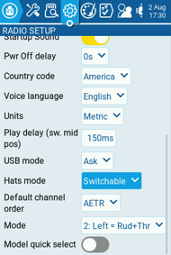
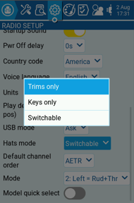
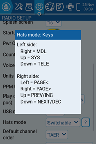
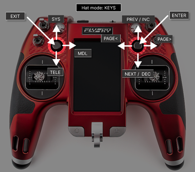
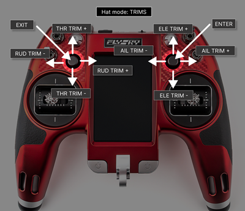

На пультах NV14 та EL18 можна здійснювати навігацію по пунктах меню за допомогою перемикачів Trim hat.

На екрані Radio Setup ви можете налаштувати **Hats Mode**, вибравши одну з наступних опцій:

* **Trims** **only**: Перемикачі Trim hat використовуватимуться лише для налаштування значень тримерів.
* **Keys only**: Перемикачі Trim hat використовуватимуться для навігації по пунктах меню (як описано нижче).
* **Switchable**: Функціональність перемикачів Trim hat можна змінювати між **Trims** та **Keys** "на льоту".

### Як перемикатися між режимами "на льоту"

1. Налаштуйте **Hats Mode** як **Switchable**.
2. Натисніть та утримуйте **Left Hat.**
3. Одразу після цього натисніть **Right Hat**.

:::info
Коли пульт вмикається, а **Hats Mode** встановлено на **Switchable**, початковим режимом завжди буде **Trims**.
:::

---

Джерело: [EdgeTX User Manual 2.11](https://github.com/EdgeTX/edgetx-user-manual/blob/2.11/color-radios/user-interface/trim-navigation.md), ліцензія [CC BY-SA 4.0](https://creativecommons.org/licenses/by-sa/4.0/). Український переклад підготовлений для dead.md.
