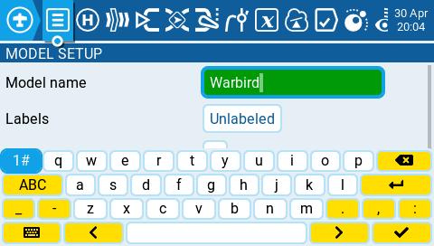
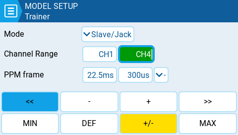

Для зручного введення тексту та чисел EdgeTX використовує віртуальні текстові та цифрові клавіатури, з якими можна взаємодіяти за допомогою сенсорного екрана або ролика. Крім того, існують комбінації клавіш, призначені для апаратних кнопок, як описано нижче:

### Комбінації клавіш для текстової клавіатури з використанням апаратних кнопок.

#### Пульти з однією кнопкою PGUP/DN та X12S

* **\[SYS]** = курсор ліворуч
* **LONG \[SYS]** = курсор на початок
* **\[MDL]** = зміна режиму клавіатури (великі літери, малі літери, цифри + спецсимволи, цифрова)
* **LONG \[MDL]** = backspace
* **\[PGDN]** = перемикання регістру
* **\[PGUP]** (X12S) = перемикання регістру
* **LONG** PGDN = delete
* **\[TELE]** = курсор праворуч
* **LONG \[TELE]** = курсор в кінець

#### Пульти з окремими кнопками PGUP та PGDN

* **\[SYS]** = зміна режиму клавіатури (великі літери, малі літери, цифри + спецсимволи, цифрова)
* **LONG \[MDL]** = backspace
* **\[PGDN]** = курсор праворуч
* **LONG \[PGDN]** = курсор в кінець
* **\[PGUP]** = курсор ліворуч
* **LONG** PGUP = курсор на початок
* **\[TELE]** = перемикання регістру
* **LONG \[TELE]** = delete

### Комбінації клавіш для цифрової клавіатури з використанням апаратних кнопок.

#### Пульти з однією кнопкою PGUP/DN та X12S

* **\[SYS]** = `-`
* **LONG \[SYS]** = `MIN`
* **\[MDL]** = `>>`
* **LONG** **\[MDL]**= `+/-`
* **\[PGDN]** & **\[PGUP]** = `<<`
* **LONG** **\[PGDN]** & **\[PGUP]** = `DEF`
* **\[TELE]** = `+`
* **LONG \[TELE]** = `MAX`

#### Пульти з окремими кнопками PGUP та PGDN

* **\[SYS]** = `<<`
* **LONG \[SYS]** = `MIN`
* **\[MDL]** = `>>`
* **LONG \[MDL]** = `MAX`
* **\[PGDN]** = `+`
* **\[PGUP]** = `-`
* **\[TELE]**= `+/-`
* **LONG** **\[TELE]** = `DEF`

---

Джерело: [EdgeTX User Manual 2.11](https://github.com/EdgeTX/edgetx-user-manual/blob/2.11/color-radios/user-interface/virtual-keyboards.md), ліцензія [CC BY-SA 4.0](https://creativecommons.org/licenses/by-sa/4.0/). Український переклад підготовлений для dead.md.
