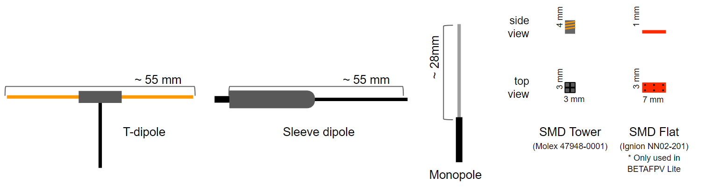
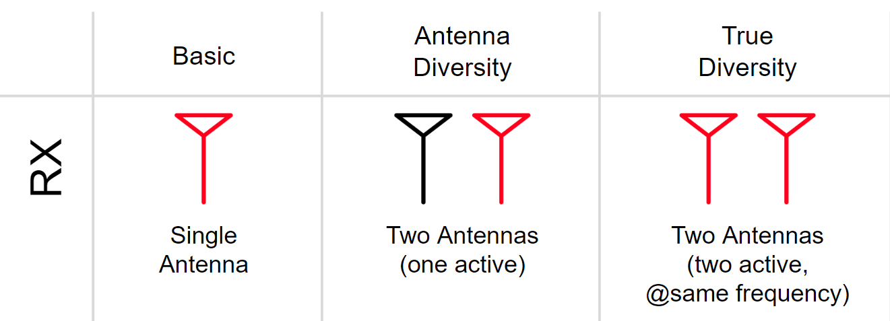
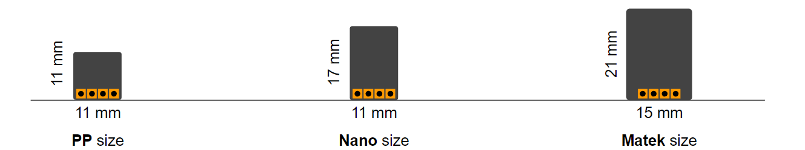
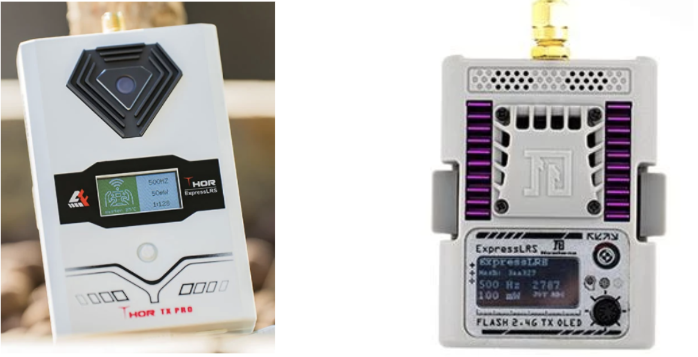
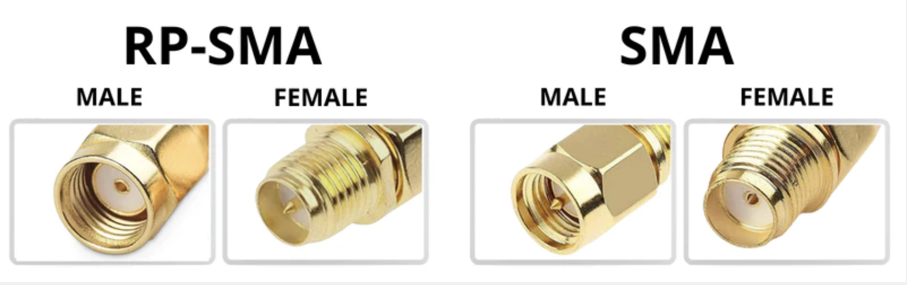
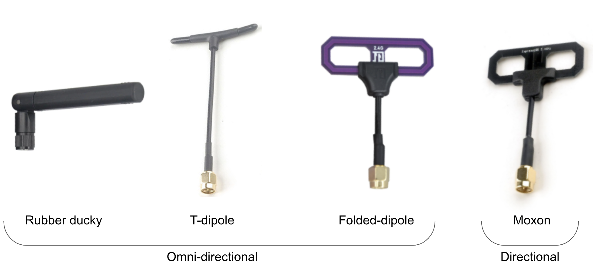
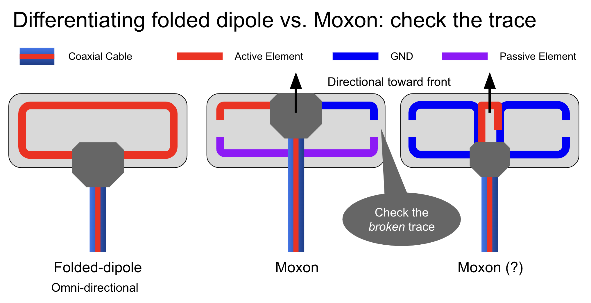
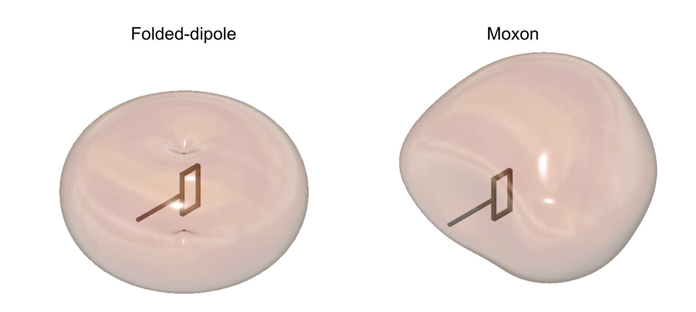
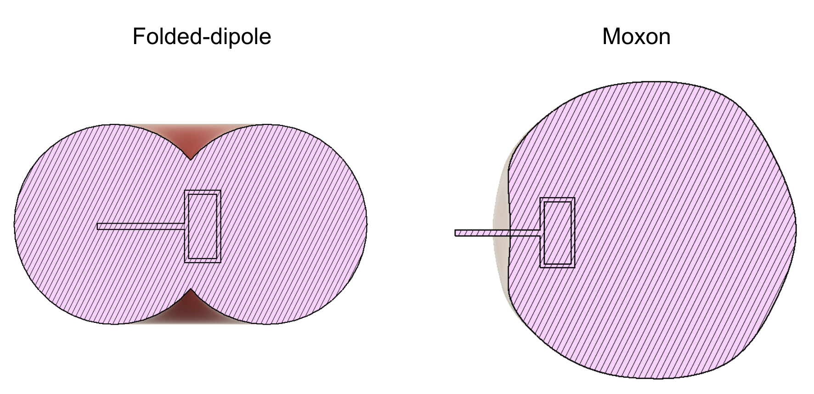
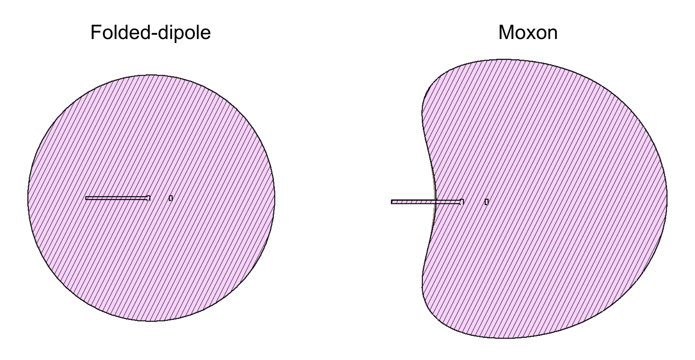

ExpressLRS має ту перевагу, що на ринку є безліч варіантів TX-модулів та приймачів від різних виробників. Це викликає питання: "що найкраще?" Немає найкращого варіанту обладнання, є лише той, який має потрібні вам функції за ціну, яку ви готові заплатити, у потрібному вам розмірі. ExpressLRS не рекомендує конкретний бренд або модель, але надає інформацію, яка допоможе вам вибрати правильне обладнання ELRS для ваших потреб. На наступній сторінці будуть перераховані виробники та функції, на які слід звернути увагу в їхньому обладнанні.

:::note[Підтримуване обладнання]
Команда ExpressLRS (ELRS) тісно співпрацює з виробниками обладнання для перевірки та тестування пристроїв. Конкретний target додається до ExpressLRS Configurator лише після завершення цього процесу валідації.

Якщо обладнання немає у списку в Configurator, воно або не відповідає вимогам проєкту, або виробник вирішив не співпрацювати з проєктом ELRS. У таких випадках за підтримкою слід звертатися безпосередньо до виробника.

Висновок: завжди перевіряйте ExpressLRS Configurator на наявність підтримуваного обладнання та розглядайте можливість підтримки виробників, які активно роблять внесок у розробку з відкритим вихідним кодом та проєкт ExpressLRS.
:::

## Вибір приймача
Цей розділ створено для переліку деяких загальних характеристик приймачів та наведення прикладів приймачів із цими характеристиками.

Кожен білд відрізняється, але ось рекомендовані речі, на які слід звернути увагу при виборі приймача:

  * **Вупи / Зубочистки (Toothpicks) / Легкі літальні апарати:** Розмір, мабуть, є найважливішою характеристикою, тому легкий маленький приймач із вбудованою антеною буде найкращим вибором.
  * **Гоночні квадрокоптери:** Розмір знову ж таки найважливіший. Керамічні антени важче пошкодити, а зменшення дальності через їх розміщення всередині рами не є проблемою через невелику дальність польоту. Зовнішню дипольну антену 2.4GHz все ще досить легко встановити і сховати для невеликого покращення порівняно з керамічною, але з'являється ризик її відрубати пропелерами (Choppage).
  * **Фрістайл квадрокоптери:** Мінімальний розмір більше не є проблемою, тому приймачі розміру Nano тут будуть найкращим вибором. LNA забезпечить кращий прийом за перешкодами. Зовнішні антени також є перевагою, але вам потрібно знайти компроміс між тим, наскільки відкритою буде антена, і ризиком її відрубати. Diversity може бути дуже корисним у сценаріях на середніх дистанціях, щоб запобігти спрямуванню "мертвих зон" (nulls) антени на пульт, а також блокуванню однієї антени карбоном або бетоном.
  * **Long Range:** Вам точно знадобляться LNA, зовнішня антена та PA для збільшення дальності телеметрії. Це не означає, що вони обов'язкові для дальніх польотів: 5 км можна досягти на приймачі з керамічною антеною без LNA/PA при 250Hz/100mW за умови прямої видимості. Diversity може бути корисним для далеколітних квадрокоптерів, щоб запобігти блокуванню антен карбоном або спрямуванню "мертвих зон" антени на пульт у певних орієнтаціях під час польоту. Для літаків без польотного контролера чудово підійдуть PWM приймачі. Для абсолютно максимальної дальності 900MHz може більше, але 2.4GHz все ще здатні на 50+ км.

### Частота

ExpressLRS пропонує системи як на 2.4GHz, так і на 900MHz, причому кожна працює лише з приймачами та TX-модулями тієї ж частоти. 2.4GHz наразі є найпопулярнішою частотою з огляду на її легальність, характеристики та вартість. Лінк на 2.4GHz пропонує найвищий Packet Rate, що забезпечує краще відчуття контролю (locked-in) під час пілотування, і при цьому пропонує величезну дальність. 900MHz — це оригінальна частота для long-range, яка все ще може бути чудовою для середовищ із високим рівнем забруднення WiFi завдяки трохи кращому проникненню.

Для нових користувачів, якщо ви не плануєте літати на сотні кілометрів або в середовищі з високим рівнем шуму, ми рекомендуємо обладнання на 2.4GHz, наприклад:

  * Happymodel EP Series
  * Radiomaster RP Series
  * NamimnoRC Flash Series

Якщо у вас є система R9 або подібна, або ви плануєте літати за межі розумних відстаней, ось кілька чудових приймачів на 900MHz:

  * BetaFPV Nano900
  * Happymodel ES900RX
  * GEPRC Nano 900MHz

### Тип антени

Антени — це те, через що радіохвилі надходять до приймача та виходять з нього. ExpressLRS пропонує багато різних типів антен, причому диполі та керамічні антени (див. [SMD Antennas](https://github.com/ExpressLRS/Docs/blob/master/docs/hardware/smd-antenna.md)) є найпоширенішими типами антен для приймачів. З точки зору дальності: Керамічна антена < Міні-диполь (у стилі "Minimortal-T") < Sleeved диполь < Напівхвильовий диполь. Діаграма антен та їх розмірів для діапазону 2.4GHz наведена нижче:

Якщо не зазначено інше, більшість приймачів мають роз'єм U.FL/IPEX, який підтримує зовнішні антени. Деякі приймачі з керамічними антенами:

  * Happymodel EP2
  * Radiomaster RP2
  * MatekSys R24-S

### Diversity

Diversity покращує прийом порівняно зі стандартними приймачами за рахунок використання кількох антен. Стандартний приймач має одну антену, тоді як antenna diversity використовує дві антени та перемикач для маршрутизації сигналу з однієї або іншої. True diversity йде ще далі, використовуючи два радіочіпи, кожен з яких підключений до окремої антени, і вибираючи той, який має найсильніший прийом у будь-який момент часу. Це забезпечує рівень резервування, який особливо корисний для польотів, де "мертві зони" антени можуть бути спрямовані на пілота (наприклад, фрістайл).

Деякі приймачі з antenna diversity:

  * Radiomaster RP3
  * Namimno Flash Diversity
  * Matek R24-D

Деякі приймачі з true diversity:

  * Happymodel EP1 Dual
  * BetaFPV SuperD

### PWM

PWM використовується для апаратів, які не мають польотних контролерів, і дозволяє безпосередньо керувати ESC та сервоприводами. Дивіться сторінку про [PWM](pwm-receivers.md) для отримання більш детальної інформації щодо використання PWM.

Деякі PWM приймачі:

  * MatekSys R24-P6
  * Happymodel EPW6
  * Radiomaster ER5A/C

### PA/LNA

Підсилювач з низьким рівнем шуму (LNA) безпосередньо додає до вашого вхідного RSSI. Типове підсилення становить близько +12dBm, що буде відображатися в RSSI як на 12dBm вище, ніж було б без LNA. Це відбувається тому, що LNA підсилює вхідний сигнал, що надходить від антени, перед тим як він потрапить на RF-чіп, що збільшує чутливість приймача за рахунок посилення вхідного сигналу. LNA також підсилює шум на таку ж величину, тому межа чутливості, ймовірно, буде нижчою за значення, вказане в Lua Script.

Підсилювач потужності (PA) підсилює потужність вихідного сигналу та збільшує дальність телеметрії назад до пульта. Без PA вихідна потужність обмежується максимальною вихідною потужністю самого RF-чіпа (близько +13dBm 20mW). Це працює так само, як і збільшення вихідної потужності на TX-модулі, однак сам підсилювач не регулюється. Вихідна потужність приймача може працювати на регульованих рівнях залежно від потреб у дальності. Більшість PA мають потужність 20dBm/100mW, що означає, що потужність передачі телеметрії можна налаштувати на 10, 25, 50 або 100mW.

Приймачі з PA/LNA матимуть вказану вихідну потужність телеметрії у dBm або mW.

Деякі приймачі з PA та LNA:

  * Radiomaster RP3 (100mW)
  * Skystars Nano SS24D (20dBm)
  * MatekSys R24-D (23dBm)
  * BetaFPV SuperD (20dBm)

### Розмір

Світ FPV здригнувся, коли ELRS випустили приймачі, які були вдвічі менші за приймачі розміру "nano", мали вбудовану антену і при цьому забезпечували кілометри дальності при 250Hz/100mW. Маленький приймач може поміститися в тісних місцях, але пам'ятайте, що розміщення керамічної антени крихітного приймача глибоко в стеку за карбоном знижує його продуктивність, яка і так була знижена через відмову від підсилювачів заради зменшення розміру. Більші приймачі ELRS знову мають ці підсилювачі, пропонуючи кращий прийом і дальність телеметрії ціною розміру та ваги. Загальні класи розмірів показані нижче, але існують й інші приймачі з дещо іншими розмірами:

Приймачі розміру PP (абсолютно найменші, найменша дальність незалежно від антен):

  * Happymodel EP/PP
  * Radiomaster RP
  * BetaFPV Lite

Приймачі розміру Nano (середнього розміру, можуть мати PA/LNA, але зазвичай не мають деяких функцій):

  * BetaFPV Nano
  * iFlight RXes
  * Namimno Flash Diversity RX
  * Axisflying Thor RX
  * Namimno Flash RX

Більші приймачі (найбільш функціональні, але й значно більші за розміром):

  * Matek R24-D
  * Radiomaster RP3
  * BetaFPV SuperD

## Вибір TX-модуля та пульта
У цьому розділі перераховані деякі загальні характеристики TX-модулів та пультів, а також наведені приклади пристроїв із цими характеристиками.

У кожного свої потреби щодо пульта чи модуля, але основні зводяться до розміру, дальності та інтеграції.

### Вбудовані TX-модулі

Деякі виробники випускають пульти із вбудованими модулями ELRS, що забезпечує тіснішу інтеграцію з ELRS. Їх можна оновлювати через сам пульт, а також зазвичай через WiFi, як це є стандартом.

Деякі пульти із вбудованим ELRS:

  * RadioMaster TX16S ELRS
  * RadioMaster Zorro ELRS
  * BetaFPV Lite Radio 3 Pro ELRS
  * Jumper T-Pro
  * Jumper T-Lite v2

Помітним винятком із цього списку є iFlight Commando, який, хоча і має вбудований у пульт TX, насправді підключений як зовнішній модуль і просто розміщений всередині корпусу. Він підтримує зовнішній модуль і, що важливо, має варіанти як на 868/915MHz, так і на 2.4GHz.

### Частота

ExpressLRS пропонує системи як на 2.4GHz, так і на 900MHz, причому кожна працює лише з приймачами та TX-модулями тієї ж частоти. 2.4GHz наразі є найпопулярнішою частотою з огляду на її легальність, характеристики та вартість. Лінк на 2.4GHz пропонує найвищий Packet Rate, що забезпечує краще відчуття контролю (locked-in) під час пілотування, і при цьому пропонує величезну дальність. 900MHz — це оригінальна частота для long-range, яка все ще може бути чудовою для середовищ із високим рівнем забруднення WiFi завдяки трохи кращому проникненню.

Для нових користувачів, якщо ви не плануєте літати на сотні кілометрів або в середовищі з високим рівнем шуму, ми рекомендуємо обладнання на 2.4GHz, наприклад:

  * Axisflying Thor
  * RadioMaster Ranger
  * HappyModel ES24TX Pro
  * Namimno Flash

Якщо ви хочете розширити межі дальності, система на 900MHz може підійти для ваших потреб. Деякі готові TX-модулі на 900MHz:

  * Namimno Voyager
  * Happymodel ES900TX
  * BetaFPV Micro 915/868MHz

### Розмір

Більшість TX-модулів ExpressLRS належать до одного з двох класів — Micro та Nano. Існують деякі винятки, які підходять до кількох класів або мають цікаві функції, що можуть зробити їх кращими для ваших потреб.

Модулі Micro підходять до відсіку JR стандартного пульта, такого як TX16s або QX7. Деякі приклади:

  * RadioMaster Ranger Micro
  * Namimno Flash
  * HappyModel ES24TX

Модулі Nano підходять до відсіку lite-модуля, наприклад, на Zorro, T-Pro або X-Lite. Деякі приклади:

  * HappyModel ES24TX Slim Pro
  * RadioMaster Ranger Nano
  * Jumper AION Nano
  * BetaFPV Nano

Деякі помітні винятки, які можуть підходити до кількох або дуже специфічних відсіків для модулів:

  * HappyModel ES24TX Lite - Підходить для Jumper T-Lite
  * Axisflying Thor - Має систему проводів для підключення до будь-якого пульта з виходом CRSF
  * Radiomaster Ranger - включає кріплення Micro та Nano, а також проводку для будь-якого пульта, сумісного з CRSF

### Потужність

Більшість TX-модулів ELRS мають обмеження потужності 250mW або 500mW, але якщо вам потрібно полетіти трохи далі, існує кілька модулів на 1W (див. [Закон обернених квадратів](https://en.wikipedia.org/wiki/Inverse-square_law) для інформації про те, чому 1W не подвоює дальність порівняно з 500mW), які забезпечують необхідну потужність для ще більшої дальності. Ці TX-модулі оснащені великими радіаторами, вентиляторами, а іноді й датчиками температури для охолодження RF-компонентів. Деякі з цих TX-модулів на 1W:

  * HappyModel ES24TX Pro
  * RadioMaster Ranger (Full Size, Micro and Nano all are 1W)
  * Axisflying Thor
  * BetaFPV Micro TX 1W
  * RadioMaster Boxer
  * Jumper T-Pro Internal
  * NamimnoRC Flash (both OLED & non-OLED models)

### Екрани

Деякі TX-модулі мають невеликий екран, який відображає корисну інформацію, і працюють у парі з невеликим джойстиком для швидкої зміни налаштувань на ходу. Це може бути корисно при використанні з пультами, прошивка яких не підтримує Lua Script. Два основні типи екранів — це TFT та OLED:

Єдиний TX-модуль із TFT-екраном на ринку на даний момент — це Axisflying Thor TX.

Деякі TX-модулі з OLED:

  * Namimno Flash OLED
  * RadioMaster Ranger
  * BetaFPV Micro TX
  * Jumper AION Nano

### Backpack

Більшість сучасних TX-модулів включають [Backpack](https://github.com/ExpressLRS/Docs/blob/master/docs/hardware/backpack/esp-backpack.md), який забезпечує зв'язок з аксесуарами, такими як VRX, що дозволяє більш тісно інтегрувати пульт і дрон. TX-модулі із вбудованим Backpack:

  * HappyModel ES24TX Pro
  * HappyModel Slim Pro
  * NamimnoRC Flash
  * AxisFlying Thor
  * RadioMaster Zorro
  * BetaFPV Micro TX 1W

### Антени

Окрім вбудованих у пульт передавачів, усі TX-модулі ELRS підтримують багато антен, тому це слугує посібником щодо типів антен та роз'ємів.

TX-модулі ELRS мають два роз'єми, які візуально схожі — SMA та RP-SMA

На ці роз'єми встановлюються багато типів антен, які мають різні типи діаграм спрямованості. На першому малюнку зображені типи антен, які зазвичай продаються разом із TX-модулями:

Найпоширенішими антенами, що продаються, окрім звичайних диполів, є моксони (moxon) та складені диполі (folded dipole), які візуально виглядають схожими, що допомагає розрізнити їх:

Діаграми спрямованості моксона та складеного диполя зображені нижче в ізотропному вигляді, збоку та зверху

  
  

### Додаткові "фішки" (Bling Features)

Деякі TX-модулі мають додаткові "фішки" (bling features), які є менш важливими, ніж інші перелічені характеристики. До них належать RGB-світлодіоди, датчики температури та G-сенсори.

[RGB-світлодіоди](https://github.com/ExpressLRS/Docs/blob/master/docs/quick-start/led-status.md) є на багатьох сучасних TX-модулях і також слугують корисним індикатором статусу.

Датчики температури корисні для TX-модулів вищої потужності, щоб вмикати вентилятор лише за потреби, а не працювати постійно під час передачі, що зменшує рівень шуму. Наразі єдиним TX-модулем із цією функцією є Axisflying Thor.

G-сенсори / датчики руху використовують 3-осьовий лінійний акселерометр для визначення орієнтації пульта, а також можуть використовувати удар (bump) для передачі керування у функції [loan model](https://github.com/ExpressLRS/Docs/blob/master/docs/software/loan-model.md). TX-модулі, які постачаються з цією функцією — це Axisflying Thor та RadioMaster Ranger.

---

Джерело: [ExpressLRS Docs](https://github.com/ExpressLRS/Docs/blob/master/docs/hardware/hardware-selection.md), ліцензія [GPLv3](https://github.com/ExpressLRS/Docs/blob/master/LICENSE). Український переклад підготовлений для dead.md.
