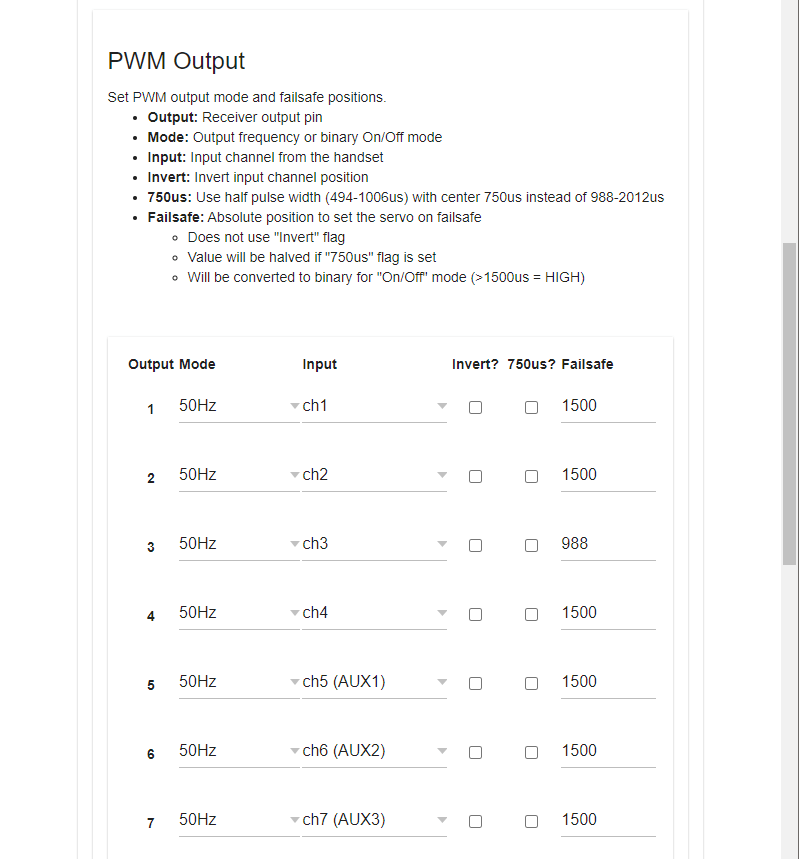
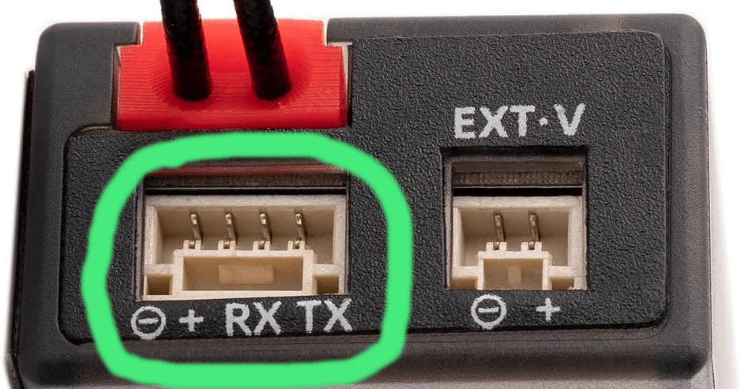

ExpressLRS тепер підтримує прямий вивід PWM з приймачів. Ця документація стосується лише приймачів з нативним виводом PWM, а не приймачів, підключених до зовнішніх конвертерів CRSF у PWM, таких як [CRServoF](https://github.com/CapnBry/CRServoF/) або [Matek CRSF-PWM-C](http://www.mateksys.com/?portfolio=crsf-pwm).

## Мапінг каналів та Failsafe
Мапінг каналів за замовчуванням є прямим: CH1 з пульта йде на PWM Output 1, CH2 на Output 2 і т.д. Щоб змінити це на приймачах на базі ESP, дозвольте приймачу перейти в режим WiFi, а потім використовуйте WebUI для налаштування мапінгу. Будь-який вхідний канал можна призначити на будь-який вихідний канал, і той самий вхід можна використовувати для будь-якої кількості виходів. AUX1/CH5 завжди є 1-бітним, тому ви, ймовірно, захочете змінити цей мапінг на канал з більшою роздільною здатністю.

_PWM Output WebUI_

Значення failsafe також встановлюються за допомогою цього інтерфейсу зі значеннями в діапазоні від 988us до 2012us. Failsafe спрацьовує, якщо приймач підключено і Link Quality (LQ) падає до 0, або пройшла 1 секунда без отримання валідного пакета каналів, залежно від того, що станеться раніше. Під час запуску імпульси не генеруються, поки пульт не підключиться, що дозволяє виконати калібрування газу ESC стандартним методом "підняти газ перед підключенням". Значення failsafe за замовчуванням становить 1500us для всіх каналів, крім Output 3, для якого за замовчуванням встановлено 988us.

## Роздільна здатність каналів
Вивід PWM все ще залежить від роздільної здатності протоколу ELRS, що означає, що за замовчуванням все ще є лише 4 канали з повною роздільною здатністю (10-бітні CH1-CH4) та 8 каналів перемикачів (CH5-CH12). Для найкращої роздільної здатності на каналах перемикачів використовуйте `Switch Mode: Wide` та `TLM Ratio` від `1:8` до `1:256` для 7-бітної (128 позицій) роздільної здатності каналів перемикачів. Вищі значення TLM Ratio (1:2 та 1:4) знижуються до 6-бітної (64 позиції) роздільної здатності. Пам'ятайте, що канали перемикачів надсилаються по одному на пакет у режимі Wide, і потрібно 8 пакетів, щоб надіслати всі 7 каналів (наприклад, режим 150Hz 1:64 = 18.657Hz оновлень для CH6-CH12). AUX1/CH5 надсилається в кожному пакеті у всіх режимах перемикачів, але є лише 1-бітним (2 позиції). Дивіться [Switch Configs](https://www.expresslrs.org/software/switch-config/) для отримання додаткової інформації.

:::info[Full-Resolution Switch Modes]
ELRS v3 тепер підтримує [режими перемикачів з повною роздільною здатністю](https://www.expresslrs.org/software/switch-config/#full-resolution-switch-configuration-modes), які забезпечують 8, 12 або 16 каналів з повною роздільною здатністю (10-біт) на частоті 100Hz (900MHz та 2.4GHz) або 333Hz (лише 2.4GHz). Для PWM приймачів з більш ніж 4 каналами рекомендується використовувати один з режимів full-res для найкращої продуктивності.
:::

## Підтримувані режими виводу
Приймачі ELRS підтримують наступні режими виводу PWM:

* Частоти виводу PWM: 50Hz, 60Hz, 100Hz, 160Hz, 333Hz, 400Hz
* Нормальна ширина імпульсу (988-2012us - центр 1500us), розширена ширина імпульсу (885-2115us - центр 1500us), а також сервоприводи з половинною шириною імпульсу (494-1006us - центр 750us)
* 10kHz Duty Cycle 0-100% PWM (наприклад, для керування FET колекторного мотора)

Крім того, виходи також можна налаштувати на:

* Binary On/Off (вивід сигналу High/Low)
* DSHOT300 (для керування ESC безколекторних моторів; лише для приймачів на базі ESP32)

## Serial вивід
PWM приймачі також можуть виводити будь-який підтримуваний [serial протокол](https://www.expresslrs.org/software/serial-protocols/), такий як CRSF або SBUS. [Виберіть бажаний протокол виводу](https://www.expresslrs.org/software/serial-protocols/#receiver-protocol-selection) за допомогою Lua Script ELRS або на вкладці Model у WebUI приймача.
Піни за замовчуванням, що використовуються для serial виводу, відрізняються залежно від приймача. Якщо ваш приймач має виділений serial порт (наприклад, RadioMaster ER6, ER8, ER8G(V)), serial вивід здійснюватиметься через цей порт. В іншому випадку [перевірте вкладку Model](https://www.expresslrs.org/software/serial-protocols/#pwm-receiver-serial-pin-selection) у WebUI приймача, щоб побачити, які піни можна призначити на Serial TX та RX (зазвичай Ch2 та Ch3).

_Serial порт JST-GH на PWM приймачі RadioMaster ER6_

:::warning[Advanced Output Mapping]
Досвідчені користувачі можуть перепризначити виходи serial, I2C та PWM на будь-який доступний пін за допомогою сторінки hardware.html у WebUI приймача. Будь ласка, звертайтеся у [Discord ELRS](https://discord.gg/dS6ReFY), якщо вам потрібна допомога з налаштуванням нестандартного мапінгу виходів приймача.
:::

---

Джерело: [ExpressLRS Docs](https://github.com/ExpressLRS/Docs/blob/master/docs/hardware/pwm-receivers.md), ліцензія [GPLv3](https://github.com/ExpressLRS/Docs/blob/master/LICENSE). Український переклад підготовлений для dead.md.
