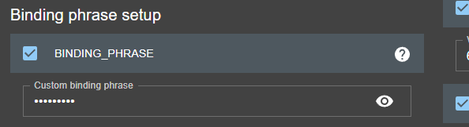
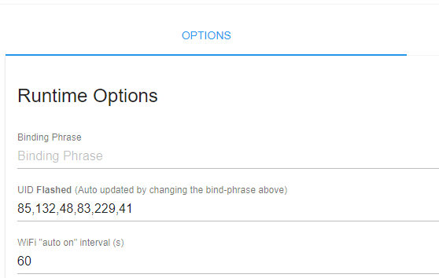
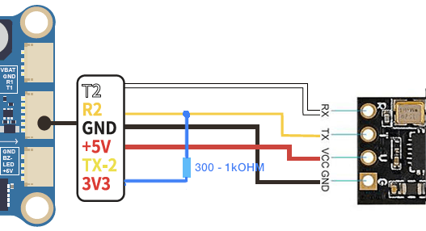
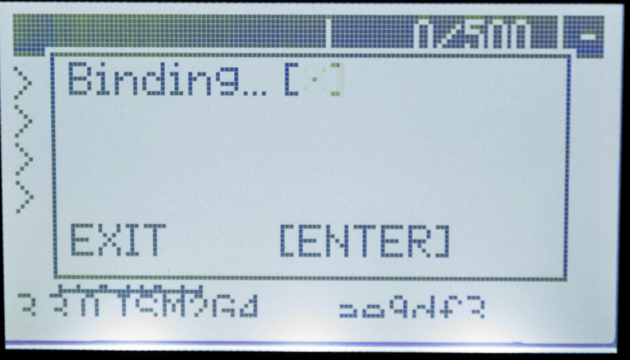
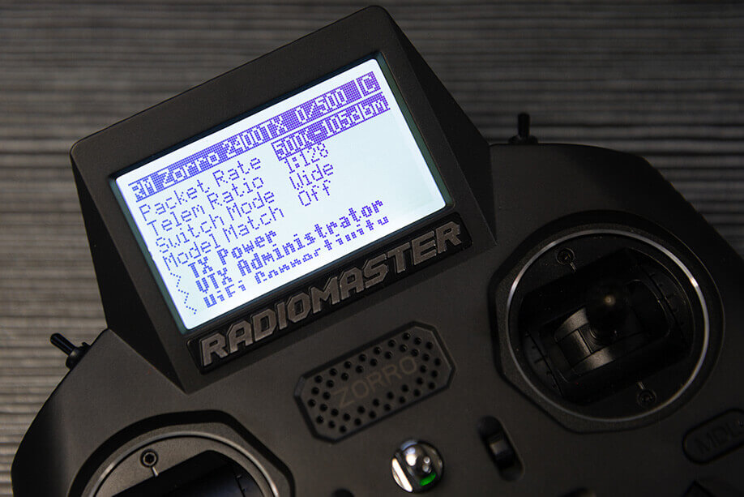

Перша цифра у версії прошивки має збігатися між TX Module та приймачем.

Приклади:

- TX Module з версією 3.1.2 буде синхронізуватися та працювати з приймачем з версією прошивки 3.0.1
- TX Module з версією 3.2.0 НЕ буде синхронізуватися або bind-итися з приймачем з версією прошивки 2.4.0
- Приймач з версією 3.1.2 буде синхронізуватися та працювати з TX Module з версією прошивки 3.0.1
- Приймач з версією 3.2.0 НЕ буде синхронізуватися або bind-итися з TX Module з версією прошивки 2.4.0
- SPI-приймачі на (офіційному) Betaflight 4.3.1 та старіших версіях будуть синхронізуватися або bind-итися лише з прошивкою ExpressLRS 2.x
- SPI-приймачі на Betaflight 4.4.0 та новіших версіях будуть синхронізуватися або bind-итися лише з прошивкою ExpressLRS 3.x

Якщо версії ваших прошивок несумісні, ЖОДЕН з наведених нижче методів не спрацює.

Перегляньте ці сторінки, щоб дізнатися, як перевірити версію прошивки на ваших пристроях ExpressLRS:

- [TX Modules](https://github.com/ExpressLRS/Docs/blob/master/docs/quick-start/transmitters/firmware-version.md)
- [Receivers](https://github.com/ExpressLRS/Docs/blob/master/docs/quick-start/receivers/firmware-version.md)
- [SPI Receivers](https://github.com/ExpressLRS/Docs/blob/master/docs/hardware/spi-receivers.md)

## Як привʼязати пристрої ExpressLRS один до одного

Існує **ДВА** методи, щоб привʼязати/синхронізувати TX Module ExpressLRS та приймач:

1. [Використання унікальної Binding Phrase](#unique-phrase)
2. [Традиційний метод привʼязки](#traditional-binding)

Якщо ви все одно збираєтеся оновлювати або перепрошивати firmware ExpressLRS на вашому пристрої, використання Binding Phrase є найочевиднішим вибором.

З виходом ExpressLRS v3.0 оновлення вашої Binding Phrase через WebUI є ще більш вагомою причиною використовувати Binding Phrase.

Нижче наведені різні процедури привʼязки для ExpressLRS.

## Унікальна фраза {#unique-phrase}
Ви можете вибрати коротку та просту Binding Phrase для ваших пристроїв перед прошивкою або оновленням, використовуючи поле в [ExpressLRS Configurator](installing-configurator.md).

_Поле Binding Phrase_

Як альтернатива, ви також можете змінити Binding Phrase через WebUI, якщо ваш пристрій підтримує WiFi і вже оновлений до ExpressLRS 3.0 або новішої версії. Перегляньте цю [сторінку](webui.md) для посібника користувача WebUI.

_Поле Binding Phrase у WebUI_

Ми рекомендуємо використовувати **унікальну** фразу з щонайменше 8 буквено-цифрових символів. Найкращий кандидат — ваш нікнейм пілота. Ця фраза не повинна бути складною або надсекретною, оскільки це не пароль і не ключ шифрування.

:::info[Чи є моя binding phrase секретом?]
Ні, так само як і канал вашого VTX не є секретом. Binding phrase потрібна не для безпеки, а для уникнення колізій. Якби всі тримали свій канал VTX у секреті, шанси випадково збити когось із неба були б досить високими. Щоб забезпечити найкращі шанси не заважати іншим пілотам, а їм — не заважати вам, переконайтеся, що ви не використовуєте таку ж дурну bind-фразу, як хтось інший. Виразіть свій стиль і трохи креативності за допомогою кумедної або зухвалої bind-фрази.
:::
## Традиційна привʼязка {#traditional-binding}

Щоб традиційна привʼязка спрацювала, Binding Phrase не повинна бути встановлена, принаймні для приймача.

:::info[Оновлено у 3.4.0]
Будь-який приймач, прошитий версією 3.4.0 або новішою, можна перевести в режим привʼязки (Bind Mode), навіть зі встановленим Binding UID.
:::

:::warning[Зверніть увагу]
Приймач, прошитий або налаштований з Binding Phrase, НЕ БУДЕ ініціювати режим ручної привʼязки, скільки б разів ви не намагалися виконати процедуру нижче. Спочатку потрібно перепрошити приймач з вимкненим та/або порожнім полем Binding Phrase. Але навіщо вам не використовувати bind-фразу, якщо вам все одно доводиться прошивати приймач? :grin:
:::
Світлодіод приймача також повинен блимати при подачі живлення.

:::danger[Світлодіод приймача не блимає]
Ось що ви можете зробити, якщо приймач знаходиться в режимі Bootloader:

1. Перевірте, чи не затиснута кнопка Boot на приймачі, або чи не пошкоджена вона.
    - Якщо кнопка затиснута або защемлена, усуньте причину. Термоусадка іноді може натискати кнопку на приймачі.
    - Якщо кнопка пошкоджена, видаліть її або замініть приймач на кращий. Спробуйте звернутися до продавця щодо заміни.

2. Якщо приймач не має кнопки Boot, а замість неї є контактний майданчик Boot, перевірте, чи не з'єднаний він з майданчиком Ground (земля).
    - Якщо майданчик Boot з'єднаний з Ground, роз'єднайте або приберіть це з'єднання.

3. Від'єднайте дроти RX та TX приймача від польотного контролера. Знову подайте живлення на дрон або літак. Ще раз поспостерігайте за світлодіодом на приймачі.
    - Якщо він почне повільно блимати (інтервал 500 мс), вам потрібно буде перепаяти дроти приймача на інший UART.
    - Якщо інший UART зайнятий іншою периферією, від'єднайте її та поміняйте місцями з приймачем.
    - Якщо іншого повноцінного UART немає, ви можете спробувати підпаяти Pull-up резистор: підключіть резистор (номіналом від 300 Ом до 1 кОм; менше значення ефективніше) між майданчиком RX цього UART та майданчиком 5v або 3.3v, як показано нижче:

4. Якщо ви використовуєте будь-яку з цифрових FPV-систем, таких як DJI FPV Air Unit, Caddx Vista або DJI O3 Air Unit, і ви припаяли або підключили всі шість дротів до вашого польотного контролера, вам потрібно буде від'єднати дріт SBUS/DJI HDL.
:::
Процедура наступна:

1. Вимкніть ваш пульт.
2. Перезавантажте приймач по живленню 3 рази.
    - Подайте живлення на приймач.
    - Світлодіод приймача загориться.
    - Вимкніть його протягом 2 секунд.
    - Повторіть ще 2 рази.

:::warning[Обережно]
Цей крок найкраще виконувати за допомогою польотного LiPo акумулятора, тому переконайтеся, що ви правильно підключили польотний контролер і перевірили його на наявність коротких замикань.
:::

3. Переконайтеся, що світлодіод швидко блимає двічі — це означає, що приймач перебуває в режимі привʼязки.

4. Увімкніть ваш пульт і скористайтеся кнопкою **[BIND]** у Lua Script ExpressLRS, яка надсилає імпульс привʼязки. Спливаюче вікно ненадовго з'явиться, а потім зникне.

5. Якщо світлодіод приймача почав світитися постійно, він привʼязаний!

## Оновлена процедура привʼязки починаючи з ExpressLRS 3.4.0

З [PR#2542](https://github.com/ExpressLRS/ExpressLRS/pull/2542), що увійшов до оновлення 3.4.0, користувачі тепер мають наступні методи, щоб bind-ити приймач ExpressLRS з TX Module:

1. Binding Phrase, прошита або встановлена (через WebUI) на обох пристроях.
2. 3-разове перепідключення живлення.
3. Кнопка `Bind Receiver` у вкладці Receiver у Betaflight Configurator 10.10 (або новішому) (CLI-команда `bind_rx` також працює). Це спрацює ТІЛЬКИ якщо ваш польотний контролер прошитий Betaflight 4.5.0 або новішою версією.
4. Натискання кнопки на самому приймачі протягом 1.5с (або замикання майданчика Boot на Ground).

При використанні останніх 3 методів світлодіод приймача блимне двічі, зробить паузу і повторюватиме це, доки не буде встановлено привʼязку, про що свідчитиме постійне світіння світлодіода. Натискання `[Bind]` у Lua Script ExpressLRS має встановити привʼязку, згідно з процедурою традиційної привʼязки вище.

Після того, як приймач привʼязаний будь-яким із наведених вище методів, користувачі можуть будь-коли повернути приймач у режим привʼязки, скориставшись будь-яким із 3 останніх методів. Привʼязка зберігатиметься в приймачі доти, доки не буде ініційована інша процедура привʼязки будь-яким із наведених вище методів.

Щоб скасувати режим привʼязки, потрібне перезавантаження або перепідключення живлення, або ж привʼязка приймача до пульта. Якщо приймач перезавантажити без нової привʼязки, буде використана стара інформація про привʼязку.

Опцію в Lua Script або WebUI можна перемкнути, щоб зробити привʼязку тимчасовою (volatile) до перепідключення живлення або перезавантаження. Тимчасова привʼязка означає, що вона дійсна лише поки приймач увімкнений. Після перепідключення живлення або перезавантаження приймача інформація про привʼязку стирається, і приймач завантажиться в режимі привʼязки.

## Перевірка з'єднання

Використовуючи [Lua Script ExpressLRS](https://github.com/ExpressLRS/Docs/blob/master/docs/quick-start/transmitters/lua-howto.md), знайдіть літеру `C` у верхньому правому куті екрана, яка вказує на те, що TX Module та приймач з'єднані та обмінюються даними.

1. Натисніть кнопку **SYS** на вашому пульті.
    - На старіших пультах або тих, що мають лише одну кнопку Menu, потрібно буде довго натискати кнопку `context-menu`, щоб отримати доступ до системного меню.
    - Зверніться до посібника користувача вашого пульта, щоб дізнатися, як увійти до системного меню.

2. Тепер ви знаходитесь у меню Tools, де можна знайти Lua Scripts. Прокрутіть вниз і виберіть Lua Script `ExpressLRS`.

    - Якщо скрипт ніде не знайдено, завантажте його з [цієї сторінки](https://github.com/ExpressLRS/Docs/blob/master/docs/quick-start/transmitters/lua-howto.md) і збережіть у папку Scripts/Tools/ на SD-карті вашого пульта.

3. Натисніть `enter`, щоб завантажити його.

    - Якщо скрипт завис на екрані "Loading...", поверніться на сторінку [Підготовка пульта](https://github.com/ExpressLRS/Docs/blob/master/docs/quick-start/transmitters/tx-prep.md) і переконайтеся, що ви правильно налаштували ваш пульт для використання ExpressLRS.

4. У верхньому правому куті має бути видно літеру `C`, що вказує на те, що TX Module та приймач з'єднані та обмінюються даними.

:::tip[Model Mismatch]
Якщо Lua Script ExpressLRS нормально показує `C` у верхньому правому куті, але потім цей рядок зникає і замінюється рядком з написом "Model Mismatch", не хвилюйтеся. ExpressLRS виявив, що встановлений Model ID у приймачі відрізняється від Receiver ID, встановленого для поточної моделі в налаштуваннях моделі вашого пульта.

На це також вказує світлодіод приймача: 3 швидких блимання, потім пауза:

Якщо ви навмисно налаштували Model Match, дотримуючись інструкцій на [цій сторінці](../software/model-config-match.md), переконайтеся, що ваші налаштування правильні.

Якщо пункт Model Match у Lua Script ExpressLRS встановлено на On, і ви дійсно хочете використовувати функцію Model Match, ненадовго перемкніть його на Off, а потім знову на On, щоб призначити поточний приймач та Model ID приймачу.

В іншому випадку просто встановіть пункт Model Match на Off.

Якщо Model Match встановлено на Off, ненадовго перемкніть його на On і приблизно через секунду поверніть на Off. Це має очистити Model Match ID у приймачі.

Це потрібно робити, коли TX Module та приймач увімкнені та з'єднані/привʼязані.
:::
[Lua Script]: ../assets/images/lua1.jpg
[Lua Running]: ../assets/images/lua/config-bw.png

---

Джерело: [ExpressLRS Docs](https://github.com/ExpressLRS/Docs/blob/master/docs/quick-start/binding.md), ліцензія [GPLv3](https://github.com/ExpressLRS/Docs/blob/master/LICENSE). Український переклад підготовлений для dead.md.
