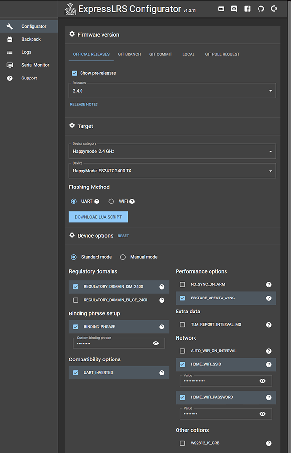
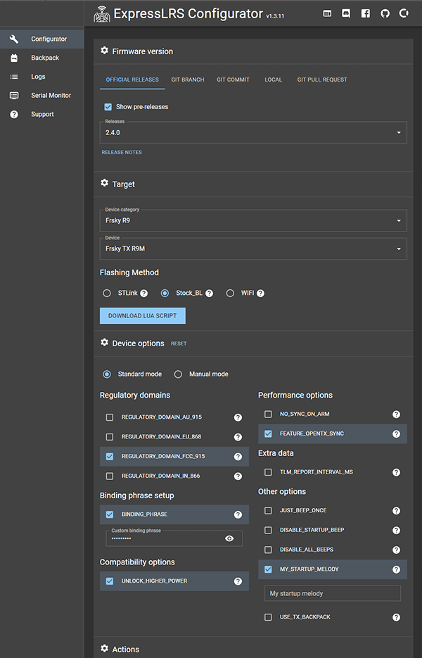
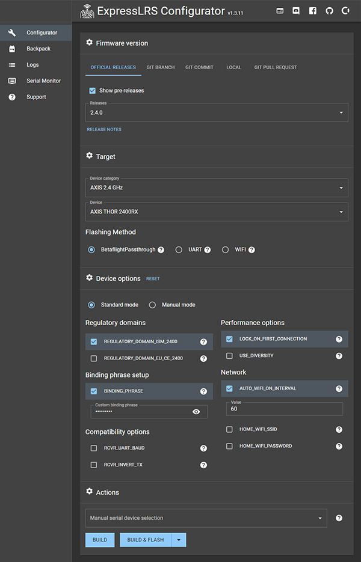
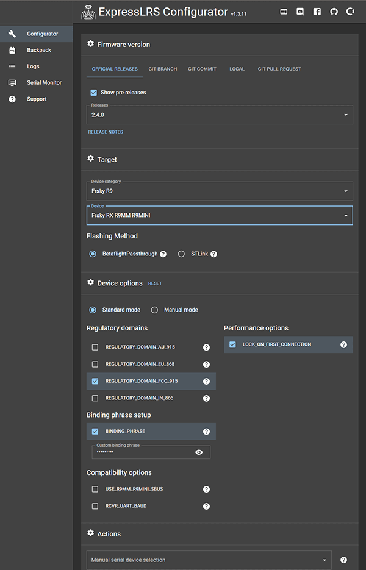

Ця сторінка має на меті пояснити лише ключові опції в ExpressLRS Configurator, які можуть знадобитися для початкового налаштування. Для повного опису **всіх** доступних опцій дивіться [сторінку User Defines](https://github.com/ExpressLRS/Docs/blob/master/docs/software/user-defines.md).

Деякі з цих опцій присутні як на TX, так і на RX target-ах. Важливо, щоб ці опції збігалися як для TX-модуля, так і для приймача, щоб вони могли bind-итися. `team2400` та `team900` також мають кілька спільних опцій, а деякі опції є унікальними для цього діапазону частот. Нижче наведено загальні опції, доступні на TX-модулях `team2400` та `team900` відповідно.





## Regulatory Domains
```
Regulatory_Domain_AU_915
Regulatory_Domain_EU_868
Regulatory_Domain_IN_866
Regulatory_Domain_FCC_915

Regulatory_Domain_ISM_2400
Regulatory_Domain_EU_CE_2400
```
Тут все відносно просто — увімкніть той Regulatory Domain, у якому ви перебуваєте, щоб вибрати діапазон частот, який буде використовуватися.

EU Regulatory Domains тепер сумісні з LBT!

## Binding Phrase

Введення Binding Phrase дозволяє пропустити крок bind-інгу з вашими приймачами — ви точно захочете це налаштувати. Будь-який пульт, що використовує ту саму Binding Phrase, підключиться до будь-якого приймача з такою ж Binding Phrase, тому будьте унікальними. Обмежтеся буквено-цифровими фразами латинського алфавіту. Приймачі, прошиті firmware, в якому не увімкнена Binding Phrase, потребуватимуть bind-інгу за допомогою традиційного [методу bind-інгу](binding.md).

## Network Options

```
HOME_WIFI_SSID
HOME_WIFI_PASSWORD
```
Налаштуйте їх, щоб режим "WiFi Update" намагався підключитися до існуючої мережі WiFi, використовуючи ці облікові дані. Вкажіть налаштування WiFi для того місця, де ви будете прошивати firmware, щоб заощадити час на перемикання мереж WiFi на вашому комп'ютері або телефоні під час процесу прошивки. Якщо пристрій не зможе підключитися до цієї мережі, він створить власну мережу.

## Other Options

```
UNLOCK_HIGHER_POWER
```
Вмикає вищу вихідну потужність для пристроїв, які її підтримують, але, можливо, розплавляться, щоб видати її вам. Не вмикайте цю опцію без попереднього оновлення системи охолодження або перевірки того, що пристрій не перегрівається під час роботи на обраній потужності.

```
UART_INVERTED
```
Це **працює лише** з TX-модулями на базі ESP32. **Майже всі пульти** вимагають увімкненого `UART_INVERTED`, наприклад FrSky QX7, TBS Tango 2 та RadioMaster TX16S. Для T8SG V2 або прошивки Deviation вимкніть це налаштування.

## Опції лише для приймача





:::warning[Note]
Налаштування приймачів повинні збігатися з налаштуваннями TX-модуля, щоб між пристроями відбулася синхронізація/bind-інг.
:::
Більшість опцій, перелічених вище для TX-модулів, також застосовуються до приймачів. Нижче наведено специфічні для приймачів опції, які можуть вам знадобитися.

### Інвертування виходу {#output-inverting}

```
RCVR_INVERT_TX
```
Якщо ви використовуєте польотний контролер, який має **лише** контакт RXI / SBUS (інвертований RX), увімкніть цю опцію, щоб інвертувати вихід CRSF з приймача для можливості використання цього контакту. Це не перетворює вихідний сигнал на SBUS, це інвертований CRSF, тому CRSF все одно має бути вибраний як протокол приймача в програмному забезпеченні польотного контролера. Лише для приймачів на базі ESP.

```
USE_R9MM_R9MINI_SBUS
```
Лише для R9MM/R9Mini: це змінює контакт, який використовується для виведення CRSF з приймача, з двох бічних контактів (A9 та A10) на контакт з позначкою "SBUS" на RX, який є інвертованим. Подібно до `RCVR_INVERT_TX`, це не перетворює вихідний сигнал на протокол SBUS, тому CRSF все одно має бути вибраний як протокол приймача в програмному забезпеченні польотного контролера.

## Чи варто мені вмикати/вимикати це?

```
NO_SYNC_ON_ARM
```
Пакети синхронізації — це один пакет кожні 5 секунд у заармленому стані. Залиште цю опцію вимкненою, якщо тільки Telemetry Ratio не встановлено на Off, оскільки ви не зможете перепідключитися після failsafe у заармленому стані, якщо вона увімкнена.

```
LOCK_ON_FIRST_CONNECTION
```
Утримує приймач на останньому Packet Rate, на якому він був у разі failsafe, замість того, щоб перебирати кожен Packet Rate для перепідключення. Слід залишити увімкненим.

## Повний список

Для отримання повного списку User Defines перейдіть на [сторінку User Defines](https://github.com/ExpressLRS/Docs/blob/master/docs/software/user-defines.md).

**Готово! Час прошити firmware на ваш пульт**

---

Джерело: [ExpressLRS Docs](https://github.com/ExpressLRS/Docs/blob/master/docs/quick-start/firmware-options.md), ліцензія [GPLv3](https://github.com/ExpressLRS/Docs/blob/master/LICENSE). Український переклад підготовлений для dead.md.
