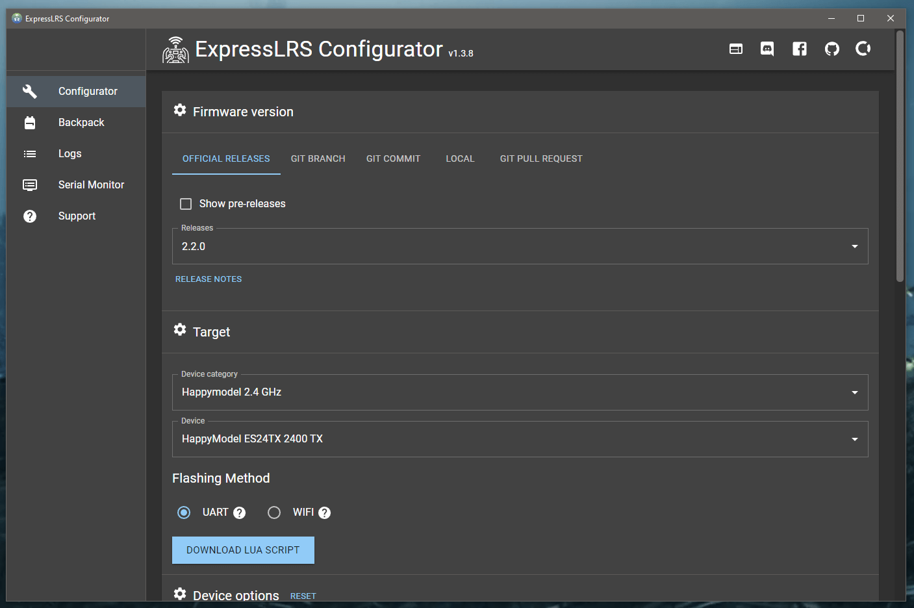

Існує два способи зібрати та прошити ExpressLRS:

1. [ExpressLRS Configurator](https://github.com/ExpressLRS/ExpressLRS-Configurator/releases) (**Рекомендовано**)
2. [Web Flasher](https://expresslrs.github.io/web-flasher/)
3. [Налаштування toolchain для розробки](https://github.com/ExpressLRS/Docs/blob/master/docs/software/toolchain-install.md) (Для досвідчених користувачів)

## Налаштування Configurator

[Завантажте](https://github.com/ExpressLRS/ExpressLRS-Configurator/releases) останню версію програми ExpressLRS Configurator для вашої платформи, дотримуючись інструкцій, написаних [jurgelenas](https://github.com/jurgelenas/).

_ExpressLRS Configurator_

Target-и для кожного з підтримуваних пристроїв можна знайти на сторінках відповідного обладнання. Використовуйте навігаційне меню зліва, щоб перейти на сторінку конкретного обладнання.

На наступній сторінці ви знайдете різні Firmware Options, які можна налаштувати, разом з їхніми поясненнями.

---

Джерело: [ExpressLRS Docs](https://github.com/ExpressLRS/Docs/blob/master/docs/quick-start/installing-configurator.md), ліцензія [GPLv3](https://github.com/ExpressLRS/Docs/blob/master/LICENSE). Український переклад підготовлений для dead.md.
