Перед першим польотом з ExpressLRS варто внести кілька змін у налаштування, щоб забезпечити стабільну роботу та отримати максимум задоволення від польотів!

## Режими

За замовчуванням ExpressLRS використовує обмежену кількість бітів для AUX-перемикачів (1 біт для AUX1 та 3-4 біти для інших AUX-каналів), що призводить до дуже грубої роздільної здатності — до 8 або 16 позицій у Betaflight/INAV на AUX-каналах. У більшості випадків цього достатньо (особливо на мультироторах), але якщо вам потрібна вища точність, увімкнення опції **Wide** Switch Mode розширює роздільну здатність каналів AUX2-AUX8 до 128 позицій. Для отримання додаткової інформації прочитайте [сторінку про режими перемикачів](https://github.com/ExpressLRS/Docs/blob/master/docs/software/switch-config.md).

Важливо пам'ятати, що Aux1 слід використовувати як перемикач Arming, де LOW (~1000us) означає `disarmed`, а HIGH (~2000us) — `armed`. AUX1 — це перемикач із низькою затримкою, який надсилається з кожним пакетом і підтримує лише роботу увімк./вимк. (2 позиції). ExpressLRS використовує AUX1, щоб визначити, чи заармлена ваша модель, і це найнадійніший спосіб дати команду моделі на дизарм. Якщо ваш перемикач arm знаходиться на іншому AUX-каналі, може пройти кілька пакетів до того, як стан цього перемикача буде передано, і немає гарантії, що приймач отримає цей пакет.

:::warning[ПОПЕРЕДЖЕННЯ]
Будь ласка, переконайтеся, що ваш **режим ARM знаходиться на каналі AUX1, а стан armed встановлено на ~2000.**
:::
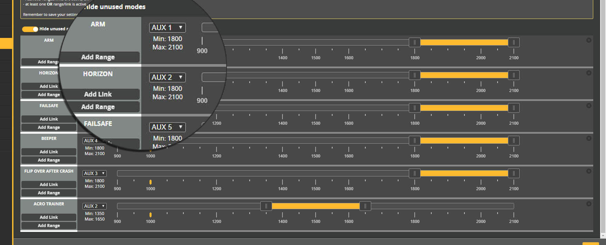

## RSSI та Link Quality

Щоб RSSI та Link Quality відображалися в OSD, встановіть для **RSSI Channel** та **RSSI_ADC** значення `Disabled`. Обидва налаштування можна знайти на вкладці Receiver.

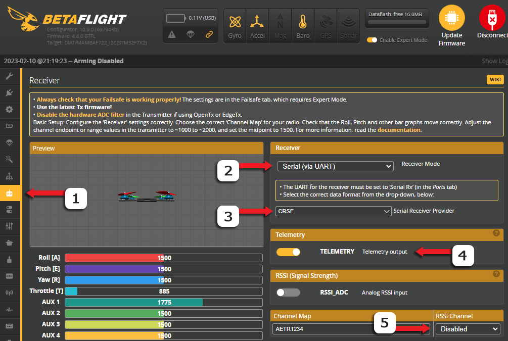

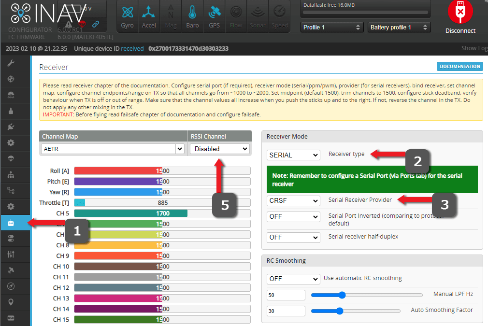

На вкладці OSD використовуйте елементи **Link Quality** та **RSSI dBm value** (а не "RSSI Value"). В INAV це знаходиться у розділі `CRSF RX Statistics`.

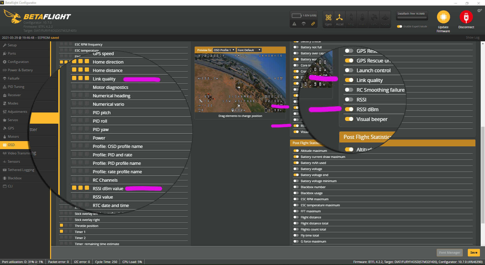

Якщо ви хочете увімкнути попередження про RSSI dBm, вам доведеться змінити рівень тривоги за допомогою `set osd_rssi_dbm_alarm = -100` у CLI. Розумним значенням є на 5-10 більше, ніж чутливість, показана в Lua Script ELRS для вашого Packet Rate (наприклад, 250Hz=-108, тому від -103 до -98 для тривоги).

Аналогічно, якщо ви хочете змінити рівень тривоги LQ, ви можете використати CLI-команду `set osd_link_quality_alarm = x`, де `x` — це ваш рівень тривоги LQ. `60` — це хороше значення для початку.

Якщо ви використовуєте DJI Goggles V1 або V2 (без root/модифікацій), вам потрібно використовувати "RSSI Value" як елемент OSD. Тому вам доведеться вибирати між LQ або RSSI, вибравши AUX11 (LQ) або AUX12 (RSSI) як RSSI Channel на вкладці Receiver (див. зображення вище).

Для цифрових FPV-систем із "Canvas Mode" або повною нативною підтримкою OSD через MSP DisplayPort (Walksnail Avatar, HDZero, DJI O3), ви можете налаштовувати їх так само, як і будь-який аналоговий FPV-сетап. Тому вам НЕ потрібно встановлювати RSSI Channel (залиште його disabled).

Більше інформації про метрики сигналу можна знайти у цій чудовій [статті про якість сигналу](https://github.com/ExpressLRS/Docs/blob/master/docs/info/signal-health.md).

## Bench Test

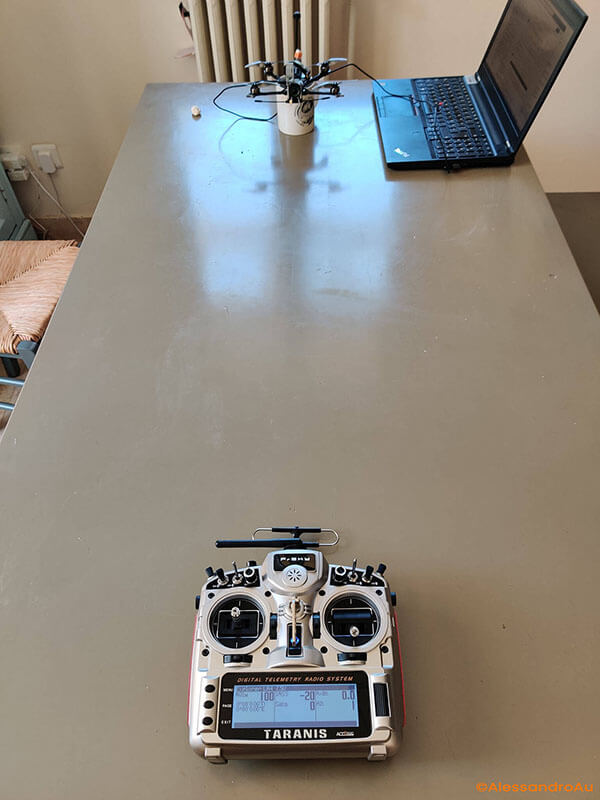

_ExpressLRS Bench Test_

Вище показано Bench Test для визначення того, чи отримуєте ви хороший сигнал від вашого пульта. Це має на меті надати вам інформацію про те, чи варто перевірити антени (зокрема Super 8 від R9), чи ваше обладнання загалом у хорошому стані.

- Встановіть ваш TX-модуль ExpressLRS на найнижчий рівень потужності за допомогою Lua Script. Packet Rate тут не має великого значення.
- Покладіть пульт на відстані 1 м (3 фути) від приймача та увімкніть його. Переконайтеся, що антени приймача та TX-модуля орієнтовані однаково. (Можливо, ви захочете тимчасово відключити ваш VTX/Air Unit, перевести VTX у pit mode або направити на нього вентилятор).
- Використовуючи OSD або сторінку телеметрії на вашому пульті, зверніть увагу на RSSI dBm або дані телеметрії 1RSS.

На обладнанні 900MHz значення близько -20dBm є хорошим показником того, що ваше обладнання працює справно. На обладнанні 2.4GHz значення від -40dBm до -25dBm вважається хорошим. Якщо ви отримуєте нижчі значення, ніж ці (ближче до 0 означає вище і краще), ось кілька речей, які ви можете перевірити:

- Антена TX-модуля ExpressLRS може бути погано закручена. На деяких 3D-друкованих корпусах модулів пластик може бути занадто товстим у місці кріплення роз'єму RP-SMA/SMA пігтейла; якщо це так, затягніть гайку на RP-SMA/SMA, щоб дати антені більше місця для щільного накручування.
- Пігтейл антени може бути пошкоджений або неправильно підключений до материнської плати модуля.
- На приймачах із SMD-антенами очікуйте нижчих значень порівняно з тими, що оснащені дротовими антенами. Якщо приймач із SMD-антеною знаходиться в термоусадці, закритий у канопі вупа, оточений карбоновими деталями або захований всередині літака/крила, очікуйте додаткового затухання сигналу.
- Антена Super 8 від FrSky, якою комплектувалася більшість R9M, відома своєю бракованістю або тим, що її характеристики погіршуються всього за кілька тижнів використання. Замініть її або, як тимчасове рішення, пропаяйте по колу місце з'єднання екранування коаксіального кабелю та роз'єму RP-SMA. Ще одним слабким місцем є підключення коаксіального кабелю до самих активних елементів. Ззовні все може виглядати нормально, але через перекручування антени з'єднання може обірватися.

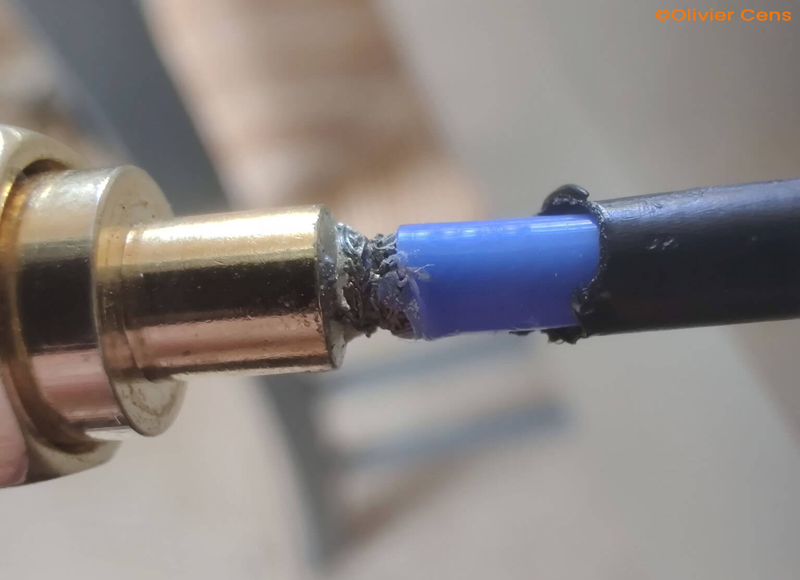

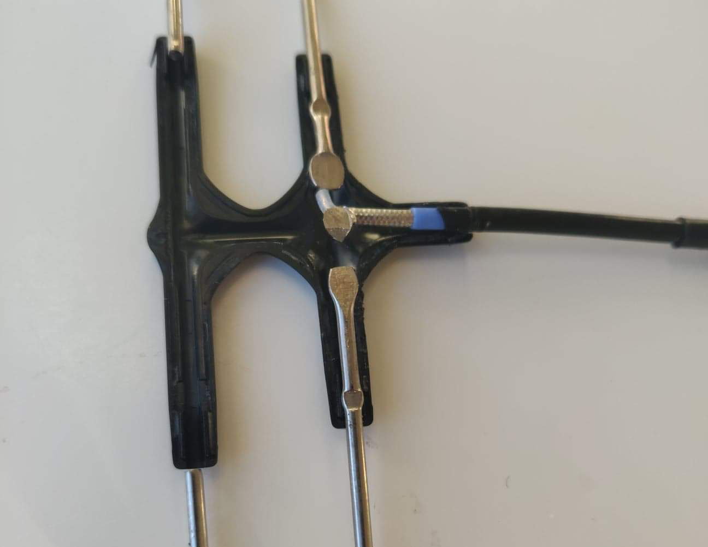

_Поширені місця поломок антени Super8_

- Перевірте, чи не бракує компонентів на ваших приймачах, наприклад, RF-фільтра (знаходиться біля антени або UFL). Також перевірте, чи не зламана і не пошкоджена SMD-антена, і чи правильно вона припаяна.

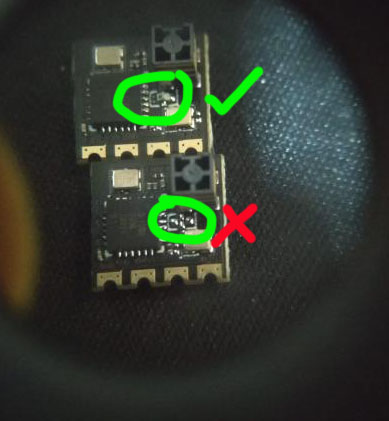

- Більшість DIY-модулів вимагають переміщення 0-омного резистора на E28 зі сторони PCB-антени на сторону UFL. Перемичка з припою також чудово спрацює, але переконайтеся, що вона знаходиться на правильних контактних площадках.
- Замініть антени на приймачі та/або TX-модулі; більшість антен приймачів ExpressLRS використовують роз'єми IPEX 1/UFL, і якщо частотне налаштування антени відповідає вашій частоті, вона повинна працювати. Ви також можете використовувати старі антени від 2.4GHz WiFi-роутерів для ваших 2.4GHz модулів, але уникайте дводіапазонних (dual-band). Також переконайтеся, що роз'єм на антені відповідний (RP-SMA на модулях R9; SMA на більшості готових модулів ExpressLRS).

## RC Link Preset (ТІЛЬКИ ДЛЯ BETAFLIGHT)
Для польотних контролерів на базі Betaflight доступні пресети 'RC Link Presets', які налаштовують згладжування feedforward та пов'язані налаштування зв'язку на основі вашого Packet Rate та сценарію використання.

:::warning
Відсутність пресету зв'язку або використання неправильного пресету для вашого Packet Rate може призвести до небажаного шуму та джитера у feedforward, що може вплинути на відпрацювання setpoint і, відповідно, на льотні характеристики.
:::
Щоб встановити правильний 'RC Link Preset', виконайте наступні кроки у **Betaflight Configurator**:

1. Перейдіть на вкладку **Preset**
1. На вкладці пресетів виберіть **Save Backup** і збережіть резервну копію в надійному місці перед застосуванням будь-якого пресету.
1. Знайдіть 'ExpressLRS' і виберіть Link Preset, який відповідає вашому [Packet Rate](https://github.com/ExpressLRS/Docs/blob/master/docs/quick-start/transmitters/lua-howto.md#packet-rate-and-telemetry-ratio). Якщо точного збігу немає, виберіть найближчий пресет, нижчий за ваш Packet Rate.

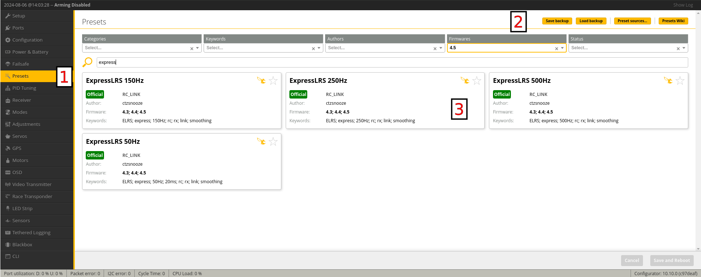

1. Ознайомтеся з опціями, відкривши випадаючий список. ПРИМІТКА: Усі вони необов'язкові; якщо жодна з них не підходить для вашої ситуації, можна залишити все без галочок.

1. Натисніть 'Pick', щоб підготувати пресет:

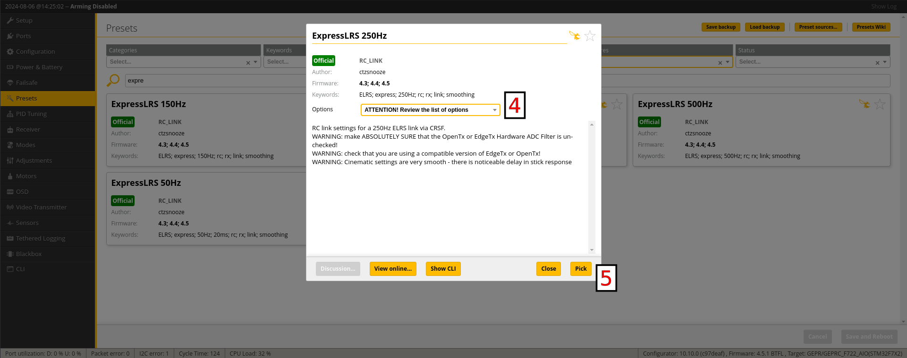

1. Натисніть **Save and Reboot**, щоб застосувати пресет:

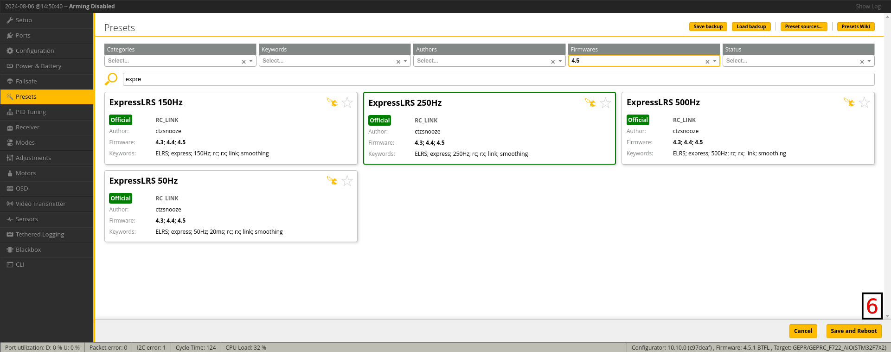

## Blackbox

Blackbox зручний для оцінки продуктивності RF-зв'язку під час польоту. Встановіть для вашого BB режим debug `RC_SMOOTHING_RATE`, який фіксуватиме частоту, з якою Betaflight отримує RC-пакети від приймача.

## Телеметрія

Приймач передає частину телеметрії, яку він отримує від польотного контролера. Вимкнення певних повідомлень працює лише в тому випадку, якщо прошивка польотного контролера це підтримує. Для Betaflight це можливо за допомогою налаштувань CLI telemetry_disabled_*:

```
# Disable Attitude telemetry item
set telemetry_disabled_pitch = ON
set telemetry_disabled_roll = ON
set telemetry_disabled_heading = ON
# Disable Battery telemetry item
set telemetry_disabled_voltage = ON
set telemetry_disabled_current = ON
set telemetry_disabled_fuel = ON
# Disable GPS telemetry item
set telemetry_disabled_altitude = ON
set telemetry_disabled_lat_long = ON
set telemetry_disabled_ground_speed = ON
set telemetry_disabled_heading = ON
# Disable Flight Mode telemetry item (BF >4.2.9)
set telemetry_disabled_mode = ON
```

Оскільки повідомлення телеметрії надсилаються з низьким пріоритетом, передача даних може зайняти певний час. Telemetry Ratio у Lua Script керує тим, як часто має надсилатися повідомлення телеметрії. Таким чином, співвідношення 1:2 означає, що кожне друге повідомлення є повідомленням телеметрії, тому дані телеметрії передаються дуже швидко. Співвідношення 1:64 означає, що лише одне з 64 повідомлень є повідомленням телеметрії, і тому передача відбувається набагато повільніше.

Частота оновлення (Packet Rate) також впливає на швидкість передачі. 50 Hz повільніше порівняно з 200 Hz. Тому, якщо вам потрібна висока швидкість оновлення телеметрії, вибирайте високий Packet Rate та співвідношення, яке сприяє повідомленням телеметрії, наприклад, 200 Hz та 1:16 зазвичай працюють добре. Для отримання детальної інформації про пропускну здатність телеметрії при різних частотах та співвідношеннях дивіться [цю сторінку про пропускну здатність телеметрії](https://github.com/ExpressLRS/Docs/blob/master/docs/info/telem-bandwidth.md).

Щоб завершити налаштування телеметрії, відкрийте сторінку телеметрії на вашому пульті, виберіть "Discover new sensors" і зачекайте, поки список заповниться.

:::info[Індикація `*`]
Зверніть увагу, що біля кожного рядка є знак *. Ця зірочка вказує на те, що цей датчик телеметрії щойно оновився.
:::

:::info[Індикація `[ ]`]
Якщо ви бачите рядок, який не змінюється, а назва рядка взята у квадратні дужки, це означає, що цей датчик не оновлювався протягом певного часу.
:::
Перші значення (включаючи RSSI та Link Quality) повинні оновлюватися постійно (миготливі зірочки). Якщо це не відбувається кілька разів на секунду, пульт видасть попередження "telemetry warning". Щоб запобігти цьому попередженню, використовуйте налаштування TLM_REPORT_INTERVAL_MS.

Це має виглядати так (і якщо це не так, з вашими налаштуваннями щось не так):


Решта значень оновлюються з іншою швидкістю (залежно від Packet Rate та Telemetry Ratio). Тому, якщо ви використовуєте 50 Hz та 1:64, це відбуватиметься повільно, і оновлення кожного датчика займатиме кілька секунд:


Якщо ви використовуєте 200Hz та 1:2 Tlm ratio, зірочки навіть не блиматимуть, оскільки оновлення відбувається дуже швидко:


## MSP

Для налаштування Betaflight з вашого пульта можна використовувати Betaflight Lua Scripts. Якщо у вас виникають проблеми, переконайтеся, що ви використовуєте останню версію [Betaflight nightly lua](https://github.com/betaflight/betaflight-tx-lua-scripts-nightlies/releases).
Для цього потрібна увімкнена функція телеметрії для приймача та TX-модуля. Якщо сторінка телеметрії вашого пульта не показує регулярних оновлень для всіх датчиків, Lua Script не працюватиме.

Щоб отримати швидкий відгук інтерфейсу, налаштуйте ExpressLRS на швидку передачу даних. Використовуйте щось на кшталт `200Hz/500Hz` з `1:2` Tlm ratio та serial baud rate щонайменше `400000`. Початкове завантаження таблиць VTX займає певний час, але після цього вони кешуються.

Якщо ви отримуєте повідомлення "retrying" під час збереження змін, це означає, що Lua Script не отримав відповідь достатньо швидко. Але зміна зазвичай все одно застосовується, тому спробуйте перезавантажити сторінку, щоб перевірити, чи збереглася зміна. З рекомендованими налаштуваннями цього не відбувається, але з повільнішими налаштуваннями це можливо.

## MAVLINK

Дивіться посібник із налаштування [MAVLink](https://github.com/ExpressLRS/Docs/blob/master/docs/software/mavlink.md) для отримання додаткової інформації.

**Готово. Вдалого польоту!**

---

Джерело: [ExpressLRS Docs](https://github.com/ExpressLRS/Docs/blob/master/docs/quick-start/pre-1stflight.md), ліцензія [GPLv3](https://github.com/ExpressLRS/Docs/blob/master/LICENSE). Український переклад підготовлений для dead.md.
