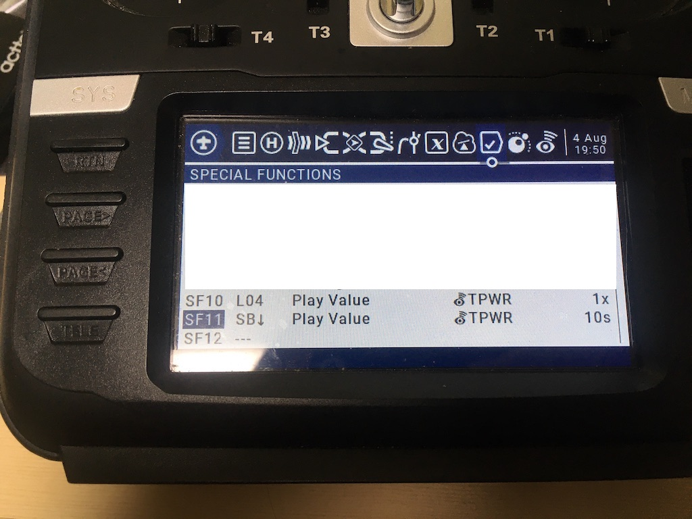

Dynamic Power дозволяє TX-модулю знижувати вихідну потужність від налаштованого рівня, використовуючи інформацію про сигнал від приймача. TX-модуль знизить потужність, якщо рівень сигналу вище порогу (див. нижче), і підвищить її, якщо це не так, якщо LQ низький або відбулося раптове падіння LQ. Оскільки Dynamic Power покладається на телеметрію, телеметрія має бути увімкнена. Тобто "Telem Ratio" має бути встановлено на будь-яке значення, окрім "Off" або "Race".

:::warning Попередження
Dynamic Power залежить від телеметрії. Якщо телеметрія не отримується, коли дрон заармлений, рівень потужності підскочить до максимального налаштованого рівня.

:::
### Як налаштувати Dynamic Power

У Lua Script ELRS виберіть `> TX Power`. Там є три елементи для налаштування.

* `Max Power`: Вихідна потужність ніколи не перевищить цей рівень за жодних обставин.
* `Dynamic`: Доступні три варіанти.
    - `Off`: Фіксована потужність, завжди встановлює потужність на налаштований рівень `Max Power`.
    - `Dyn`: Dynamic Power увімкнено.
    - `AUX9`-`AUX12`: Dynamic Power увімкнено лише тоді, коли цей AUX-канал у стані `high`, і потужність фіксується на `Max Power`, коли він у стані `low`. [Демонстраційне відео](https://www.youtube.com/watch?v=wdPWw2xu8Ig)
* `Fan Thresh`: Поріг увімкнення вентилятора. Якщо модуль має вентилятор, він увімкнеться починаючи з цього рівня потужності після короткої затримки.

Ще одне важливе налаштування — переконатися, що ваш апарат **заармлений** на AUX1=`high` (~2000us). Див. [Switch Modes](https://github.com/ExpressLRS/Docs/blob/master/docs/software/switch-config.md) для отримання додаткової інформації про AUX-канали.

## Деталі

### Початкова потужність

Під час увімкнення модуля з активованим Dynamic Power потужність передачі встановлюється на мінімально підтримувану.

### Зниження потужності

Для режимів, відмінних від FLRC, Dynamic Power використовує середнє співвідношення сигнал/шум (SNR), про яке повідомляє приймач. Якщо SNR вище порогу, потужність буде знижено на один рівень. SNR використовується тому, що він враховує перешкоди ("шум" у співвідношенні сигнал/шум) і на нього не впливають приймачі з LNA, які підсилюють RSSI dBm. Пороги для зниження потужності є специфічними для кожного Packet Rate. Наприклад, 250Hz (LoRa) знизить потужність, якщо SNR &gt;= 9.5, але 150Hz (LoRa) знизить потужність, якщо SNR &gt;= 8.5.

Для режимів FLRC (Packet Rate починається з `F` або `D`) Dynamic Power усереднює кілька останніх показників RSSI dBm від приймача. Якщо RSSI &gt;= -83dBm, потужність передачі знижується на один рівень.

Для обох алгоритмів потужність буде знижено лише в тому випадку, якщо якість зв'язку (LQ) становить 95% або вище.

### Підвищення потужності

Також діє алгоритм, протилежний "зниженню потужності", щоб повільно підвищувати потужність за потреби, наприклад, під час віддалення у польотах на великі відстані (long range). Алгоритми такі ж, як і для зниження потужності, за винятком інших порогів. Приклади:

  * 250Hz (LoRa) підвищує потужність, якщо SNR &lt;= 3.0
  * 150Hz (LoRa) підвищує потужність, якщо SNR &lt;= 0.0
  * F500 (FLRC) підвищує потужність, якщо RSSI &lt;= -89 dBm. Зверніть увагу, що всі режими FLRC використовують цей самий ліміт.

Щоб діяти на випередження, коли телеметрія не отримується, Dynamic Power також підвищуватиме потужність на один рівень за кожен пропущений пакет телеметрії, починаючи з моменту, коли пропущено два пакети поспіль.

  * TX-модуль пропускає перший пакет телеметрії: жодних дій, підтримується поточний рівень потужності
  * TX-модуль пропускає другий пакет телеметрії: потужність підвищується на 1 рівень
  * TX-модуль пропускає третій пакет телеметрії: потужність підвищується на 1 рівень
  * ...
  * TX-модуль отримує пакет телеметрії: застосовуються звичайні умови підвищення / зниження

Окрім повільного нарощування потужності, існують три умови на основі LQ, які миттєво підвищать потужність до максимального налаштованого значення.

1. Якщо LQ коли-небудь впаде нижче жорсткого ліміту (50% LQ), потужність підскочить до максимуму.
2. Якщо LQ раптово падає під час одного оновлення телеметрії порівняно з ковзним середнім (moving average). Це призначено для реакції на заліт за перешкоду, де LQ раптово погіршується і очікується його подальше падіння. Приклад: LQ тримається на рівні 100% (як це зазвичай буває в ExpressLRS), і TX-модуль отримує пакет телеметрії з 80% LQ — потужність підскочить до максимуму.
3. Якщо телеметрія повністю втрачена, коли тумблер армінгу знаходиться в положенні high. Щоразу, коли TX-модуль "відключається" під час заармленого стану, потужність підскочить до максимуму.

Нарешті, якщо отриманий LQ нижче 85% і жодна інша умова не була виконана за цей період, потужність підвищується на один рівень.

## Примітки

### Мінімально рекомендований Telemetry Ratio

Оскільки Dynamic Power покладається на інформацію, що надходить від приймача, щоб знати, як регулювати потужність, ця функція доступна лише тоді, коли "Telemetry Ratio" не встановлено на Off / Race. Будь-яке інше співвідношення дозволить їй працювати, але алгоритм оптимізовано для отримання щонайменше 2 пакетів телеметрії Link Statistics на секунду, що забезпечується опцією телеметрії "Std". Якщо ви використовуєте ручне налаштування Telemetry Ratio, рекомендується використовувати **щонайменше** співвідношення, запропоноване нижче.

| Packet Air Rate | Telemetry Ratio |
|---|---|
| 1000Hz | 1:128 |
| 500Hz | 1:128 |
| 250Hz | 1:64 |
| 200Hz | 1:64 |
| 150Hz | 1:32 |
| 100Hz | 1:32 |
| 50Hz | 1:16 |

Під час запуску вихідна потужність буде встановлена на найнижче можливе значення. Якщо телеметрія втрачається в дизармі (disarmed), вихідна потужність залишатиметься на поточному рівні, доки телеметрія не буде отримана знову. Це зроблено для того, щоб запобігти перемиканню всіх TX-модулів на максимальну потужність під час заміни акумуляторів.

### Відображення потужності в OSD

Щоб бачити поточну вихідну потужність у вашому FPV OSD, увімкніть елемент OSD `TX Uplink Power` і встановіть `Switch Mode` на `Wide` у Lua Script ELRS. `TX Uplink Power` недоступний, якщо `Switch Mode` встановлено на `Hybrid`, або на старих версіях Betaflight (&lt;4.3.0) та INAV (&lt;2.6.0).

### Озвучення потужності в EdgeTX / OpenTX

Як альтернативу, можна використати спеціальну функцію пульта (special function) для створення звукового сповіщення при зміні рівня потужності TX-модуля.

* Налаштуйте логічний перемикач (logical switch) на `|Δ|>x` / `TPWR` / `1mW`, як показано в L04 нижче. Логічний перемикач спрацьовує, коли потужність змінюється щонайменше на 1mW.

* Для озвучення при зміні потужності налаштуйте спеціальну функцію (special function), яка запускається від логічного перемикача, і призначте `Play Value` / `TPWR` / `1x` (SF10 на зображенні). Якщо ж ви віддаєте перевагу періодичному озвученню потужності, виберіть тумблер для увімкнення спеціальної функції та призначте `Play Value` / `TPWR` / (SF11 на зображенні, з інтервалом 10s).

:::info Примітка
OpenTX не має значення для 50mW у протоколі телеметрії CRSF і натомість озвучуватиме його як 0mW. Версії EdgeTX 2.5.0 і новіші мають правильне озвучення 50mW.

:::

---

Джерело: [ExpressLRS Docs](https://github.com/ExpressLRS/Docs/blob/master/docs/software/dynamic-transmit-power.md), ліцензія [GPLv3](https://github.com/ExpressLRS/Docs/blob/master/LICENSE). Український переклад підготовлений для dead.md.
