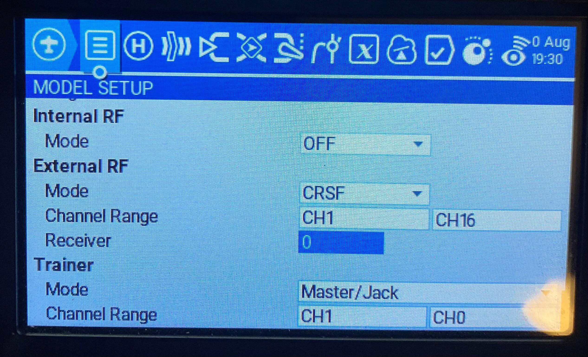
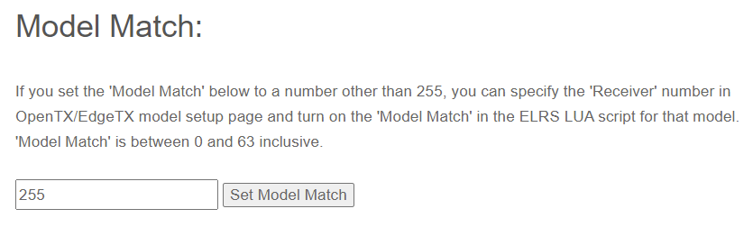

ExpressLRS зберігає окремі конфігурації для кожного номера приймача CRSF, налаштованого в OpenTX/EdgeTX. Це можна використовувати з увімкненим Model Match або без нього.

Наприклад (без Model Match), для одного дрона, що використовується для long-range та фрістайлу, можна швидко перемикати радіочастотні параметри, просто змінюючи модель на пульті.

З іншого боку, увімкнення Model Match гарантує, що приймач виводитиме сигнали керування лише тоді, коли номер приймача та номер Model Match збігаються, що запобігає випадковому керуванню не тим літальним апаратом.

Це значення виділено нижче на прикладі пульта TX16s.

Параметри, що зберігаються для кожного номера приймача:

| Налаштування | Опис |
|---|---|
| Packet Rate | Частота оновлення RC (500Hz, 250Hz тощо) |
| Telem Ratio | Співвідношення телеметрії (Off, 1:128, 1:64 тощо) |
| Switch Mode | Метод передачі станів тумблерів на приймач |
| Model Match | Увімкнення функції Model Match (див. нижче) |
| Max Power | Рівень вихідної потужності TX-модуля |
| Dynamic Power | Увімкнення динамічної зміни потужності (Dynamic Power) |

Усі інші параметри конфігурації є глобальними для всіх номерів приймачів. Зверніть увагу: не "для кожного приймача", а "для кожного номера приймача". Детальніше про параметри, що налаштовуються, див. у розділі [Lua Configuration](https://github.com/ExpressLRS/Docs/blob/master/docs/quick-start/transmitters/lua-howto.md#understanding-and-using-the-lua-script).

## Model Match

ExpressLRS використовує Binding Phrase, що означає, що TX-модуль підключиться до будь-якого приймача, прошитого з цією Binding Phrase. Model Match — це функція, яка запобігає повному з'єднанню, якщо номер Model Match не збігається. У цьому режимі приймач підключиться до пульта, але дані від приймача до польотного контролера не передаватимуться. Це дозволяє користувачеві примусово зробити так, щоб обрана в OpenTX модель підключалася лише до конкретного приймача, наприклад, щоб запобігти використанню профілю квадрокоптера в OpenTX для моделі крила (fixed wing).

Терміни номер приймача (встановлюється в OpenTX/EdgeTX) та номер Model Match (встановлюється в приймачі) використовуються тут як взаємозамінні — це одне й те саме.

Якщо опція `Model Match` має значення **Off**, то можуть бути підключені лише приймачі без номера Model Match (255). Якщо опція `Model Match` має значення **On**, то номер приймача, налаштований у конфігурації зовнішнього модуля (як показано на зображенні вище), повинен збігатися з номером Model Match, збереженим у модулі приймача, щоб приймач і TX-модуль могли повністю з'єднатися.

Реалізація дотримується наступного набору правил для обробки часткових (half) / повних (full) з'єднань:

| TX ModelMatch | TX Receiver ID | RX Model ID | Результат |
|---|---|---|---|
| Off | Будь-який | Off | **Підключається / Обмінюється даними як зазвичай** |
| Off | Будь-який | A | Підключається, але не передає дані на польотний контролер |
| On | Будь-який | Off | Підключається, але не передає дані на польотний контролер |
| On | A | A | **Підключається / Обмінюється даними як зазвичай** |
| On | B | A | Підключається, але не передає дані на польотний контролер |

### Встановлення номера Model Match

* Встановіть номер приймача, який буде використовуватися, в OpenTX Model Setup -> External Module -> Receiver
* Переконайтеся, що приймач, який потрібно призначити, підключений і має високий LQ
* Використовуйте Lua Script ExpressLRS, щоб встановити опцію Model Match на "On"
* Тепер номер Model Match приймача встановлено відповідно до номера приймача, і він буде повністю підключатися лише при використанні цього номера приймача.

**_Альтернативний спосіб_**

* Для приймачів з підтримкою WiFi використовуйте WebUI, щоб встановити Model Match безпосередньо. Опція "Model Match" все одно має бути встановлена на "On" у конфігурації через Lua Script.

### Очищення номера Model Match

* Переконайтеся, що приймач, який потрібно призначити, підключений і має високий LQ
* Використовуйте Lua Script ExpressLRS, щоб встановити опцію Model Match на "Off"
* Тепер номер Model Match приймача очищено, і він буде підключатися до будь-якого профілю конфігурації, де Model Match встановлено на "Off"

**_Альтернативний спосіб_**

* Для приймачів з підтримкою WiFi використовуйте WebUI, щоб встановити Model Match на 255 для вимкнення перевірки збігу. Опція "Model Match" все одно має бути встановлена на "Off" у конфігурації через Lua Script.

---

Джерело: [ExpressLRS Docs](https://github.com/ExpressLRS/Docs/blob/master/docs/software/model-config-match.md), ліцензія [GPLv3](https://github.com/ExpressLRS/Docs/blob/master/LICENSE). Український переклад підготовлений для dead.md.
