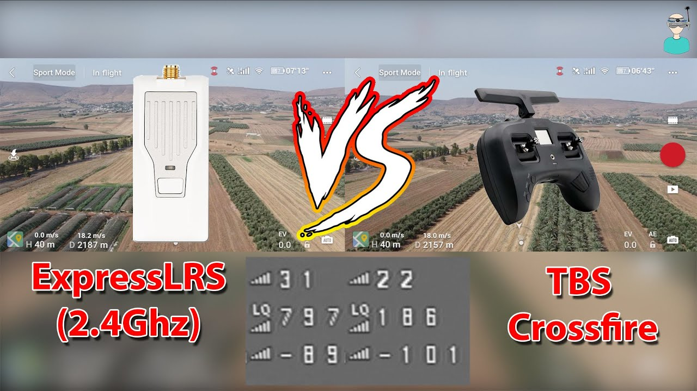

# RC General

Загальні відомості про те як працюють сучасні радіокеровані штуки.

## Основні системи
* **TBS CrossFire** - Система радіо управління, яка розробляється компанією TBS. https://www.team-blacksheep.com/products/prod:crossfire Головна перевага - висока швидкість передачі даних на великі відстані. Недолік - висока ціна.
* **ELRS** - ExpressLRS. https://github.com/ExpressLRS/ExpressLRS Це система радіо управління, яка розробляється співтовариством як opensource проект. Загалом має намір замінити CrossFire. Але як і *майже* все opensource - працює погано через недоліки описані нижче. Найбільше просувається компанією BetaFPV.
* Ще є **Qczek LRS** - абсолютний DIY що обіцяють 100500km range. Але спочатку ти маєш зібрати її. https://qczek.beyondrc.com/

## Переваги
#### TBS CrossFire
* Простий в користуванні
* Доволі зручні і компактні RX модулі що дозволяють підʼєднати від них будь-який вихідний сигнал (PWM, PPM, SBUS, IBUS, CRSF)
* Висока швидкість і відстань передачі даних
* Відсутність необхідності відповідності версій TX та RX
* MavLink на TX через Wifi

#### ELRS
* Висока швидкість і відстань передачі даних
* Ціна
* Доступний в різних частотах 2.4GHz і 900MHz
* Через відкритість системи на ринку є багато пультів з відкритими прошивками, що дозволяє використовувати їх з ELRS

## Недоліки
#### ELRS
Основна проблема полягає в необхідності відповідності версій прошивок TX та RX аж до патч версії (не впевенений що патч версія дійсно важлива). Тому якщо у вас є TX на версії 2.1.2 ви зможете керувати лише TX тієїж версії. Причому оновлення версій потребує обовʼязкової участі компʼютера в цій процедурі. Важливо зауважити що цей недолік ВІДСУТНІЙ у TBS CrossFire (у цих системах TX завжди самостійно онволює щойно привʼязаний до нього RX в автоматичному режимі за згодою оператора TX).
#### TBS CrossFire
Загалом основна проблема це ціна і недостатня кілкість пультів з вбудованим модулем TBS CrossFire.

## Корисні посилання
* https://www.team-blacksheep.com/tbs-crossfire-manual.pdf
* ExpressLRS definitive getting started guide: https://www.youtube.com/watch?v=J3Hg2f7RL1A
* TBS Crossfire Beginner Guide https://www.youtube.com/watch?v=Ypn71lIu8l8