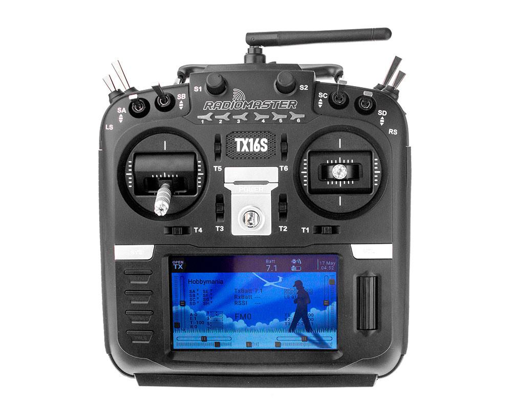
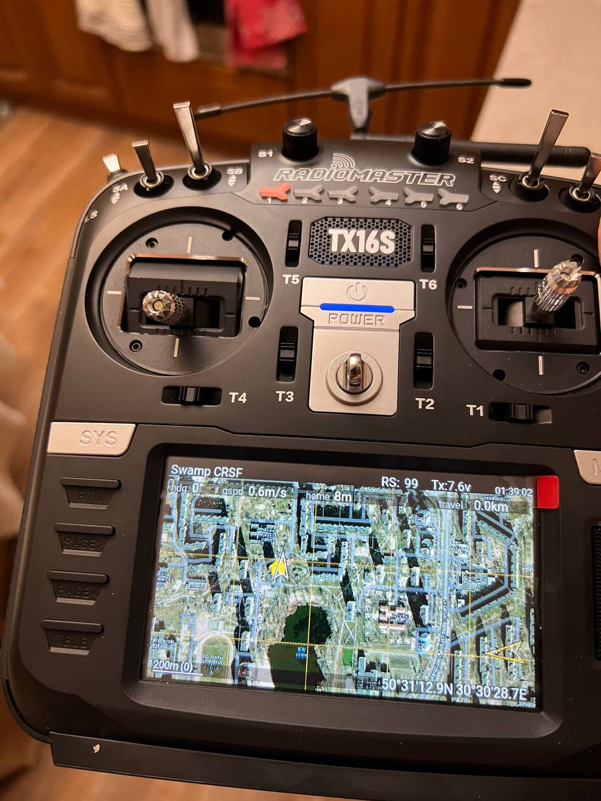

# RadioMaster TX16S

Існує 2 версії з двума типами вбудованих систем. MK1 і MK2 з системами ELRS і 4in1. Наприклад **RadioMaster TX16S MK2 ELRS**

ELRS ([rc/general](/docs/rc/general)) версія має вбудований передавач ELRS, а так звана версія 4in1 має багато квазі протоколів типу FlySky (AFHDS2A), FrSky (ACCST), Futaba, Hubsan, Spectrum (DSM/DSMX), SYMA та інші. З моєї точки зору вигідно брати версію 4в1 бо тоді в пульті буде підтримка всіх оцих іграшкових протоколів, а ELRS можна в будь-який час докупити як зовшнішній TX модуль (все інші хз де брати потім).

Пульт працює від двох 18650 (2S 7.4В LiPo), має USB-C та слот карт памʼяті. Працює на системі OpenTX https://github.com/opentx/opentx або EdgeTX https://github.com/EdgeTX/edgetx (умовно те саме що OpenTX, але Edge...)

Зовнішні модулі розміру **micro**. Також існують перехідники `micro<>nano`

Загалом відчувається open-source дух, бо в пульті є вбудований веб-сервер, який дозволяє змінювати налаштування пульту з будь-якого браузера. Також є вбудований веб-сервер для віддаленого оновлення прошивки. Все трохи топорно, але працює. Багато не очевидних фіч, які можна знайти в офіційному репозиторії.

Перед оновленням ДУЖЕ рекомендую зробити дамп SD картки, або взагалі зробити бекап памʼяті пульту. Якщо щось пішло не так, то можна відновити пульт до стану після покупки. І це важливо. Бо на пульті із коробки все працює одразу. Після оновлення прошивки і SD картки, можуть зʼявитись проблеми зі звуком, або звʼязком з модулями. Я отримав абсолютну відстутність базових налаштувань і витратив 2 години на розуміння як заставити внутрішній модуль працювати з протоколом ELRS. (виявилось просто треба виставляти протокол CRSF, а не ExpLRS).

Вбудована зарядка через USB-C дозволяє заряджати 2х 3.7В 18650 аккумулятори. Рекомендую читати інструкцію щодо зарядки.

Також можна вивести на екран дуже корисний віджет мапи якщо у вас є GPS модуль і ви отримуєте телеметрію в пульт. https://github.com/yaapu/HorusMappingWidget приклад підключення GPS модуля описаний тут [rc/crossfire](/docs/rc/crossfire) і був виконаний вперше для проекту [rc/model/swamp-thing](/docs/rc/model/swamp-thing)

# Корисні посилання
* прошивка https://github.com/EdgeTX/edgetx/releases
* контент SD карти: https://github.com/EdgeTX/edgetx-sdcard (480×272)
* озвучка https://github.com/EdgeTX/edgetx-sdcard-sounds
* LUA скрипти https://github.com/EdgeTX/lua-scripts (https://www.team-blacksheep.com/products/prod:agentx)